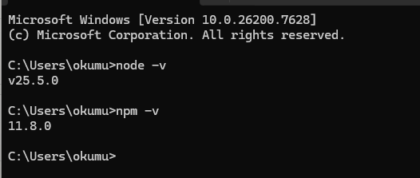
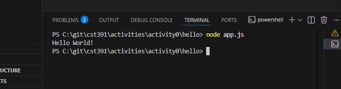
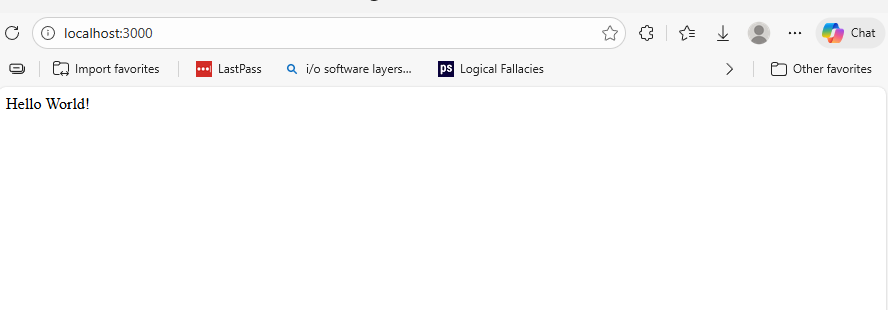
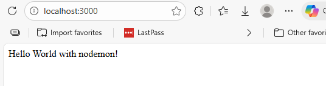
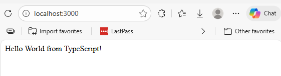
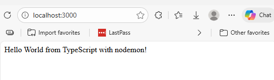

# CST-391 Activity 0

**Name:** Seline Bowens  
**Date:** 1/29/2026

---

## 1. Installation: node -v and npm -v

NodeJS and NPM installation verification showing Node.js version v25.5.0 and NPM version 11.8.0 installed successfully on Windows system.

---

## 2. NodeJS Console Application

NodeJS console application running successfully with the command 'node app.js', displaying 'Hello World!' output in the VS Code integrated terminal.

---

## 3. NodeJS Express Application

Express Hello World application running successfully in the browser at http://localhost:3000, displaying 'Hello World!' message from the NodeJS Express web server.

---

## 4. Express Application Running with nodemon

Express application running with nodemon utility at http://localhost:3000, displaying the updated message 'Hello World with nodemon!' after automatically restarting the server when code changes were detected.

---

## 5. TypeScript Node.js Application

TypeScript Node.js application running successfully in the browser at http://localhost:3000, displaying 'Hello World from TypeScript!' message from the Express server using ts-node.

---

## 6. TypeScript Application Running with nodemon

TypeScript application running with nodemon utility at http://localhost:3000, displaying the updated message 'Hello World from TypeScript with nodemon!' after automatically detecting code changes and restarting the server.

---

## 7. Commented app.ts

Fully commented TypeScript application code demonstrating understanding of each line.

