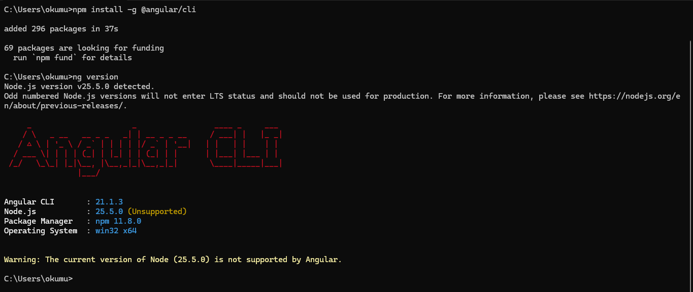
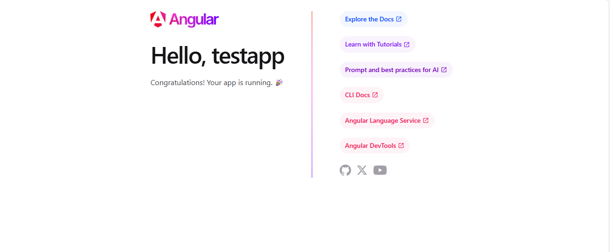
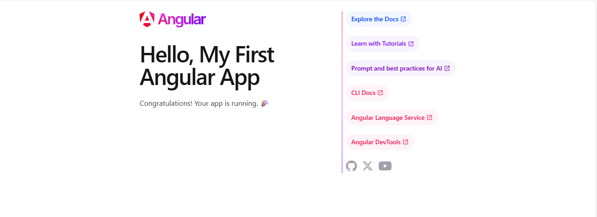
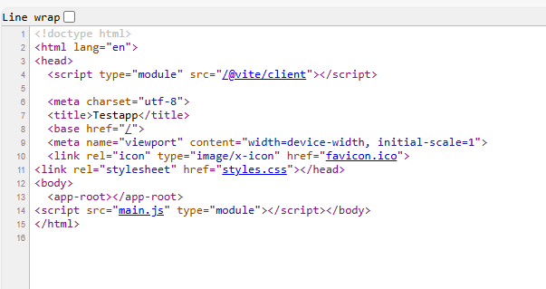
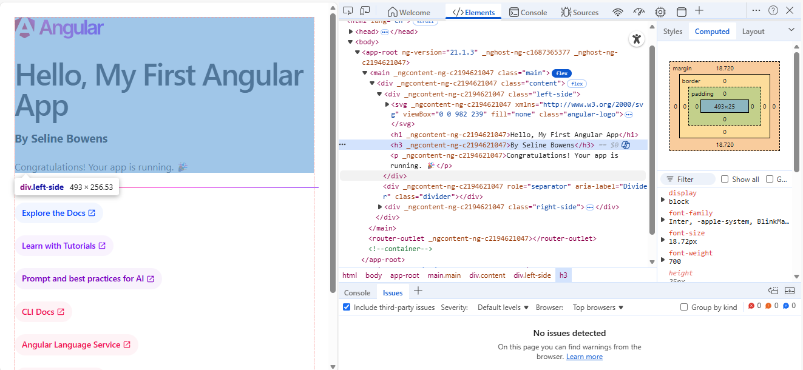
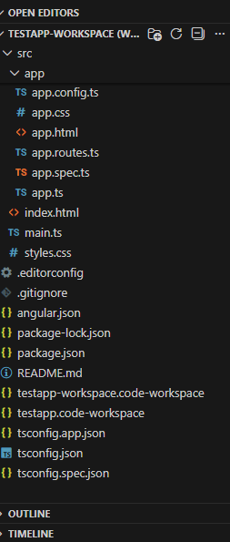

# CST-391 Activity 2: Angular Development Environment Setup

**Course:** CST-391 - JavaScript Web Application Development  
**Student:** Seline Bowens 
**Date:** February 8, 2026  
**Activity:** Installing and Configuring Angular Development Tools

---

## Table of Contents

1. [Overview](#overview)
2. [Objectives](#objectives)
3. [Tools and Technologies](#tools-and-technologies)
4. [Installation and Setup](#installation-and-setup)
5. [Screenshots and Demonstrations](#screenshots-and-demonstrations)
6. [Research Questions](#research-questions)
7. [Conclusion](#conclusion)

---

## Overview

This Lesson introduces Angular, a powerful TypeScript-based framework for building modern web applications. Angular is developed and maintained by Google and is widely used in enterprise-level applications for creating dynamic, single-page applications (SPAs). The purpose of this activity is to:
- Set up the Angular development environment
- Understand the Angular project structure
- Learn how Angular generates web pages
- Gain practical experience with Angular components and templates
- Explore the relationship between TypeScript code, HTML templates, and CSS styling

---

## Objectives

By completing this activity, I achieved the following learning objectives:

1. **Successfully install Angular CLI** and verify the installation
2. **Create a functional Angular test application** from scratch
3. **Configure Visual Studio Code** as the development environment
4. **Modify Angular components** and observe automatic browser updates
5. **Understand the Angular project structure** including key folders and configuration files
6. **Comprehend the page generation process** and how Angular renders components
7. **Document the development process** with screenshots and written explanations

---

## Tools and Technologies

This activity utilized the following tools and technologies:

- **Node.js v25.5.0** - JavaScript runtime environment
- **npm v11.8.0** - Node Package Manager for installing dependencies
- **Angular CLI v21.1.3** - Command-line interface for Angular development
- **Angular v21** - The web application framework
- **TypeScript** - Strongly-typed programming language that compiles to JavaScript
- **Visual Studio Code** - Integrated Development Environment (IDE)
- **Windows 11** - Operating system
- **Microsoft Edge Browser** - For running and testing the application

---

## Installation and Setup

### Step 1: Installing Angular CLI

The first step was to install the Angular Command Line Interface (CLI) globally on my system. The CLI is a powerful tool that allows developers to create, manage, and build Angular applications through command-line commands.

**Command used:**
```bash
npm install -g @angular/cli
```

**What this command does:**
- `npm` - Invokes the Node Package Manager
- `install` - Tells npm to install a package
- `-g` - Installs the package globally (available system-wide, not just in one project)
- `@angular/cli` - The specific package name for Angular's command-line tools

The installation process downloaded and installed 296 packages, which includes Angular CLI and all its dependencies.

### Step 2: Verifying the Installation

After installation, I verified that Angular CLI was properly installed by checking its version.

**Command used:**
```bash
ng version
```

This command confirmed that Angular CLI v21.1.3 was successfully installed and ready to use.

### Step 3: Creating the Test Application

Navigated to my project directory and created a new Angular application named "testapp".

**Commands used:**
```bash
cd C:\git\cst391\activities\activity2
ng new testapp
```
The CLI then created all necessary files and folders, installed all required packages, and set up the complete project structure.

### Step 4: Opening the Project in VS Code

I opened Visual Studio Code and loaded the testapp project then saved the workspace as "testapp-workspace" for easy access in the future

### Step 5: Running the Application

Inside VS Code, I opened the integrated terminal and started the development server:

**Command used:**
```bash
ng serve -o
```

**What this command does:**
- `ng serve` - Starts the Angular development server
- `-o` - Automatically opens the default web browser to view the application

The application compiled successfully and opened in the browser at `http://localhost:4200/`.

---

## Images and Demonstrations

### 1: Angular CLI Version Verification



This image proves the development environment is properly configured and ready for Angular development. All three essential components (Node.js, npm, and Angular CLI) are installed and functioning correctly.

---

### 2: Default Angular Application Running



The default Angular test application successfully running in the web browser at localhost:4200, displaying "Hello, testapp" with the Angular welcome screen.

---

### 3: Modified Title Display



The application displaying the modified title "Hello, My First Angular App" after editing the title signal in app.ts, demonstrating Angular's reactive data binding.

**What Changed:**

**In app.ts, I changed:**
```typescript
// FROM:
protected readonly title = signal('testapp');

// TO:
protected readonly title = signal('My First Angular App');
```

**The Result:**
The browser heading changed from "Hello, testapp" to "Hello, My First Angular App" without requiring a manual page refresh.

---

### 4: Custom Message Display


The application now displaying both the modified title "My First Angular App" and a custom message "By Seline Bowens" using a newly created message signal property, demonstrating multiple data bindings in a single component.

**Code Changes Made:**

**1. In app.ts, I added a new signal:**
```typescript
export class App {
  protected readonly title = signal('My First Angular App');
  protected readonly message = signal('Seline Bowens');  // New line added
}
```

**2. In app.html, I added a new heading:**
```html
<h1>Hello, {{ title() }}</h1>
<h3>By {{ message() }}</h3>  <!-- New line added -->
```
This image demonstrates that a single component can have multiple properties, and each can be independently bound to the template.

---

### 5: Original HTML Source (Before Angular Runs)



The HTML source code accessed via View Page Source  showing the minimal HTML structure before Angular processes the page, with the empty `<app-root></app-root>` placeholder tag. This image shows what the browser receives from the server before Angular's JavaScript code executes.

---

### 6: Rendered DOM (After Angular Runs)



The browser's Developer Tools accessed via "Element" showing the fully rendered DOM after Angular has processed the page, with the `<app-root>` tag now populated with complete HTML content including headings, images, and styling attributes. This image what the page looks like AFTER Angular's JavaScript has executed and built the user interface.

---

### 7: Angular 21 Project Structure in VS Code



VS Code Explorer panel showing the Angular 21 project structure, notably demonstrating that the `assets` and `environments` folders, and `app.module.ts` file does not exist by default in Angular 21, as required in the activity guide.

---

## Research Questions

**A.** Inspect the default test project structure created in the Activity. Describe the purpose for each of the folders and files in the project structure.

#### **FOLDERS:**

#### 1. node_modules
This folder contains all the third-party packages and libraries that the Angular application depends on to function properly. When you run the command `npm install`, Node Package Manager downloads all the necessary code from the internet and stores it in this folder. Angular uses pre-built code from other developers to handle common tasks like routing, animations, form validation, HTTP requests, and more. All this external code lives in node_modules. This folder is very large because it contains the packages the app directly uses and also all the packages that those packages depend on. This is called a "dependency tree." For example, if your app uses Package A, and Package A needs Package B to work, then both Package A and Package B will be in node_modules.

#### 2. src
The "src" folder also known as "source", is the heart of the Angular application. This is where all the code that is written lives. Everything inside this folder represents the actual application. When Angular builds the application for the web browser, it starts by looking in the src folder. It takes all the TypeScript code, HTML templates, CSS styles, and other resources, then processes them and bundles them together into files that browsers can understand. The src folder is organized in a specific way to keep projects neat and manageable. As applications grow and more features are added, most new files are created inside the src folder or its subfolders.

#### 3. src/app
This is where the actual application code lives. The "app" folder contains all the components, services, modules, and other building blocks that make up the Angular application. In Angular, everything is built using "components." A component is like a building block. It is a piece of the user interface that combines HTML, CSS, and TypeScript. For example, in a complete application, I might have:
- A navigation menu component
- A login form component
- A product list component
- A shopping cart component
- A user profile component

When I first created the Angular project, it automatically created one main component called "App" (in Angular 21, the files are `app.ts`, `app.html`, and `app.css`). This is the root component or the foundation of the application. As applications grow, developers create many more components inside this folder.

#### 4. src/assets
Though the assets folder does not exist by default in my project structure, it can be created if needed and its purpose is to store files that should be copied directly to the build output without any processing or compilation. 

#### 5. src/environments
The environments folder also missing in my structure, contains configuration files for different deployment environments. In software development, applications typically run in multiple environments:

**Development environment (`environment.ts`):**
This is used while building and testing the application on a local computer. It might contain settings like:
- Connection to a test database instead of the real production database
- Debug mode turned ON to see detailed error messages and logging
- API endpoints pointing to test servers or localhost
- Relaxed security settings for easier debugging

**Production environment (`environment.prod.ts`):**
This is used when deploying the application to the real world for actual users. It contains settings like:
- Connection to the real, live production database
- Debug mode turned OFF for security, performance, and to hide internal details
- API endpoints pointing to live, production servers
- Strict security settings
- Real data and API integrations
- Only stable, thoroughly tested features enabled
- Optimized performance settings

Many projects also have:
- `environment.staging.ts` - For pre-production testing
- `environment.qa.ts` - For quality assurance testing
- `environment.demo.ts` - For demonstration purposes

---

#### **FILES:**

#### 1. angular.json
This is the master configuration file for the entire Angular workspace and project. It tells Angular how to build, test, serve, and deploy the application. This file is in JSON (JavaScript Object Notation) format and contains detailed settings for every aspect of the project.

#### 2. package.json
This file is the heart of any Node.js project and serves as both a project manifest and a dependency manager. The package.json file serves several critical purposes such as Project Metadata which contains basic information about the project, lists all external packages the project needs, Scripts convenient commands for common tasks etc.

#### 3. tsconfig.json
This file configures the TypeScript compiler, telling it how to convert TypeScript code into JavaScript code that browsers can understand. TypeScript is a superset of JavaScript that adds static typing and other features to help prevent bugs and improve code quality. However, browsers don't understand TypeScript directly, it must be compiled to JavaScript first. The tsconfig.json file controls this compilation process.

----
**B.** Inspect the page source for the default page displayed when running the test project. Explain how the resultant page was generated by Angular by providing a brief overview and purpose for each of the following files: main.ts, app.component.css, app.component.html, app.component.ts, and app.module.ts.

#### 1. main.ts
This is the entry point of the entire Angular application. When I run `ng serve` and open the browser, it loads the application's JavaScript bundles, and the very first thing that happens is that main.ts runs. It tells Angular which component to load first and where to display it (inside the <app-root> tag in index.html). Without this file, nothing would happen.

#### 2. app.component.css (or app.css in Angular 21)
This file contains the styles (CSS) that make the component look visually appealing and control its layout, colors, fonts, and other visual aspects. Currently, my app.css is empty because the default Angular application is quite simple. As I build more complex components with custom layouts and designs, this file would grow significantly.

#### 3. app.component.html (or app.html in Angular 21)
This is the template file that defines the HTML structure and layout of the component. The template is like a blueprint that describes what the component should look like. However, it is  better than regular HTML because it supports Angular's template syntax. When data changes in the component, the template automatically updates. No need to manually manipulate the DOM. Template syntax describes what should be displayed, not how to display it.

#### 4. app.component.ts (or app.ts in Angular 21)
This is the TypeScript file that defines the logic, data, and behavior for the component. A component in Angular consists of three parts, and this file is the most important one because it controls everything the component does.

#### 5. app.module.ts
In older Angular versions, this file defines a module that groups related components, services, and other code together. My Angular 21 application uses **standalone components**, which is the newer Angular approach. Therefore, I do not have an app.module.ts file in my project.

---

**What I Learned**

1. **Modern Web Framework Architecture:** I learned that modern frameworks like Angular abstract away complex browser APIs and provide structured approaches to building applications. The framework handles routing, state management, and component lifecycle automatically.

2. **TypeScript Benefits:** Working with TypeScript instead of plain JavaScript demonstrated the value of static typing. Type checking catches errors during development rather than at runtime, making code more reliable and maintainable.

3. **Build Process:** Understanding that TypeScript must be compiled to JavaScript, that styles can be scoped to components, and that all code is bundled for browser delivery provided insight into the modern web application build pipeline.

4. **Configuration Over Convention:** Angular's use of configuration files (angular.json, package.json, tsconfig.json) taught me how professional applications manage complex settings and dependencies in a structured, maintainable way.

---

### Moving Forward

This activity builds a solid foundation for upcoming coursework. The skills and concepts learned here will be essential for:

- **Activity 3 and beyond:** Building more complex Angular applications with multiple components, services, and routing
- **Full-stack development:** Connecting Angular frontends to Node.js/Express backends
- **State management:** Managing complex application state as applications grow
- **API integration:** Making HTTP requests to RESTful APIs
- **Form handling:** Creating and validating user input forms
- **Authentication:** Implementing user login and authorization

### Reflection on the Learning Experience

The hands-on, step-by-step approach was highly effective for learning Angular. Rather than just reading documentation, actively installing tools, creating an application, and modifying code provided tangible experience with the framework.

The instant feedback from Angular's development server - seeing changes appear in the browser within seconds - made the learning process engaging and satisfying. This immediate feedback loop is crucial for understanding cause and effect in programming.

Researching the project structure and page generation process deepened my understanding beyond just following steps. Explaining how each file contributes to the final rendered page forced me to think critically about Angular's architecture and understand the framework at a fundamental level.

### Conclusion

Angular is a comprehensive framework with a learning curve, but this activity provided a gentle introduction that built confidence. The framework'sspecific file organization, naming conventions, architectural patterns, initially seemed restrictive but ultimately provides clarity and consistency. The most important takeaway is understanding that modern web development is fundamentally different from traditional approaches. Instead of manipulating the DOM directly with JavaScript, we declare what the UI should look like based on data, and the framework handles the updates. This declarative, component-based approach is the foundation of modern web development.
