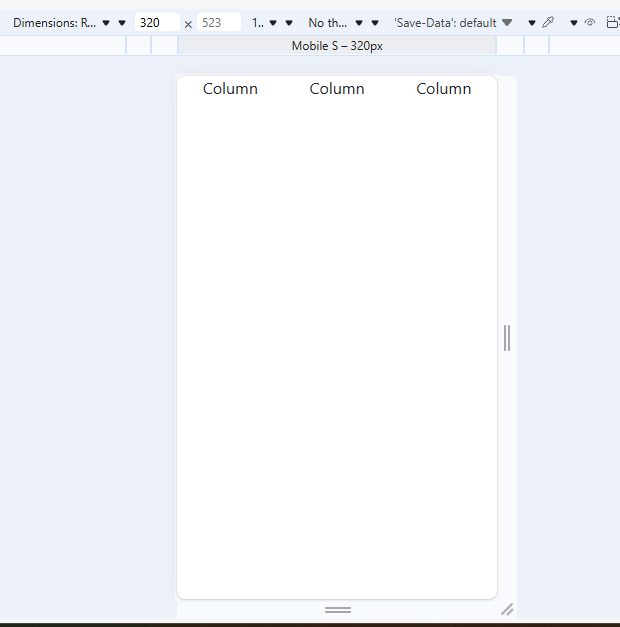
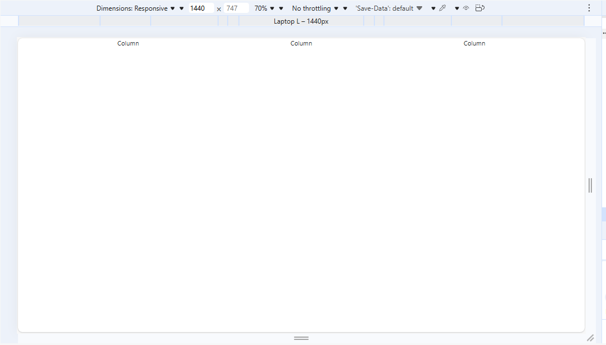
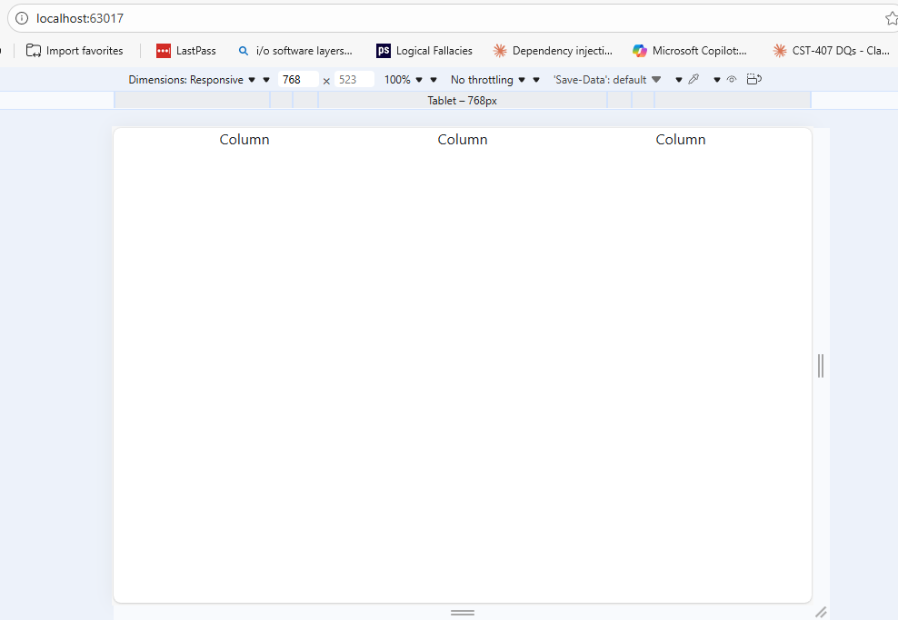
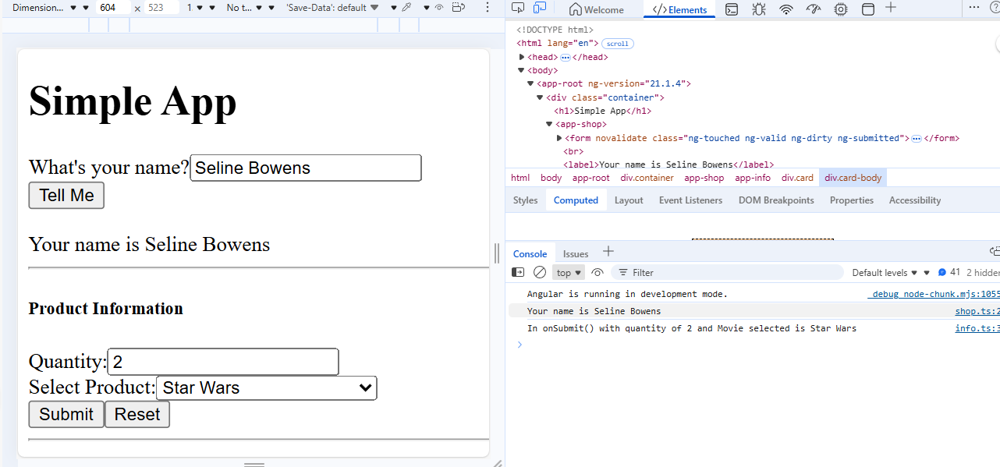
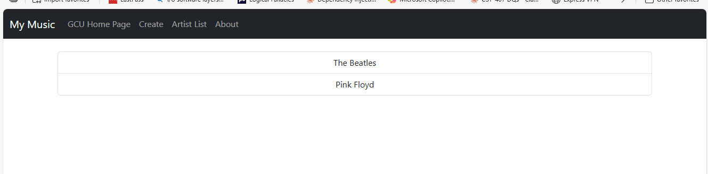
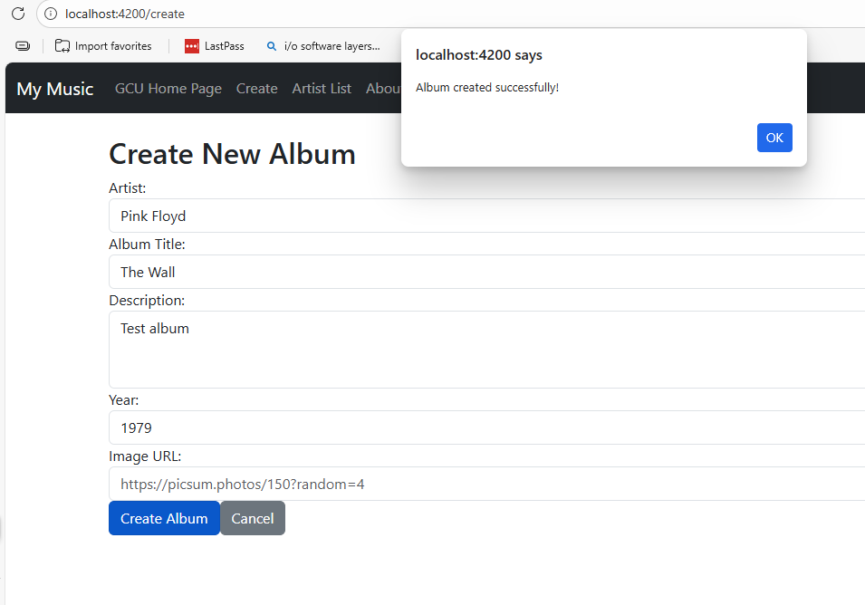
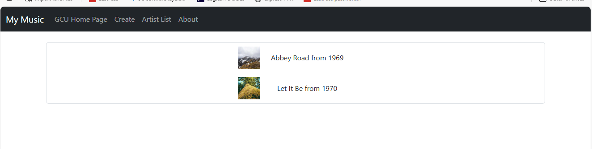
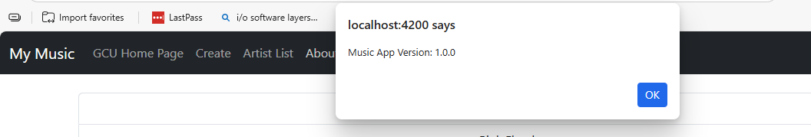

## CST-391 Activity 3: Angular Components, Data Binding, and Routing
**Course**: CST-391 - JavaScript Web Application Development

**Student**: Seline Bowens

**Date**: 02/17/2026

---
### Introduction 
This activity demonstrates building Angular applications with multiple components, data binding, form handling, and routing. The activity is divided into two parts: a simple application to learn Angular fundamentals, and a music application to practice building a complete web application.
Skills Practiced:

- Creating Angular components
- Implementing reactive and template-driven forms
- Data binding (one-way and two-way)
- Event handling
- Responsive design with Bootstrap
- Component communication
- Angular services
- Routing and navigation

---

### Part 1: Simple Application

**Overview**

This focuses on learning Angular basics by building a simple application with two components. The application demonstrates Bootstrap responsive design, reactive forms, and two-way data binding.
Components Created

1. **Shop Component** uses reactive forms with FormGroup and FormControl, handles form submission with event binding, displays user input dynamically using interpolation and logs form data to the browser console

2. **Info Component** uses template-driven forms with ngModel, mplements two-way data binding for quantity and product selection, includes dropdown menu with product options and features submit and reset functionality

### Features Implemented
- Bootstrap responsive grid layout
- Reactive form with validation
- Template-driven form with two-way binding
- Event handling (button clicks, form submissions)
- Data binding (interpolation, property binding)
- Component composition (nested components)
- Console logging for debugging

### Screenshots - Part 1
**Responsive Grid Testing** 

#### Mobile View

Bootstrap responsive grid on mobile device showing columns adapting to small screen size.

#### Desktop View

Bootstrap responsive grid on large screen showing columns displayed side-by-side.

#### Tablet View

Bootstrap responsive grid on tablet device showing medium screen layout.

#### Simple App - Complete View

Complete Simple App showing Shop Component, name form, info Component, and product selection working together with Bootstrap styling.

#### What this shows:
Shop Component collecting user name "Seline Bowens"
display updating with entered name
Info Component with quantity input (2) and product dropdown (Star Wars)
Console logging showing form submission working correctly.

---


## Part 2: Music Application

### Overview

Part 2 involved building a complete music album management application. The application allows users to browse artists, view albums, see album details, and create new albums.

**Key Concepts Learned:**
- Creating and using Angular services
- Dependency injection
- Component communication (parent-child relationships)
- Routing and navigation between pages
- Working with JSON data
- Array manipulation methods
- Bootstrap navigation bars
- Form handling for data creation

---

## Screenshots - Part 2

### Initial Application Page


The music application's initial page showing the Artist List view with The Beatles and Pink Floyd displayed in a Bootstrap list group.

---

### GCU Home Page Navigation


Clicking the "GCU Home Page" link in the navigation bar successfully opens Grand Canyon University's website in a new tab, demonstrating external link functionality.

---

### Create Album Page


The Create Album form with fields for artist selection (dropdown), album title, description, year, and image URL. The form uses two-way data binding with Angular's FormsModule. After clicking "Create Album", a success alert appears and the user is redirected to the Artist List.

---

### Artist List with New Album


The Beatles' album list displaying Abbey Road and Let It Be with album cover images and release years. Albums are displayed in a responsive Bootstrap list with images loaded from URLs.

---

### About Box


The About dialog showing "Music App Version: 1.0.0" triggered by clicking the About link in the navigation bar. This demonstrates event handling and component methods.

---

## Research Question - Part 2

**Question:** Add complete comments to music-service.service.ts

Below is the fully commented Music Service code demonstrating understanding of TypeScript service architecture, dependency injection, data management patterns, and array manipulation methods.
```typescript
/**
 * Music Service
 * 
 * This service acts as a design pattern for managing music data in the application.
 * It provides a centralized location for all CRUD (Create, Read, Update, Delete) operations
 * on albums and artists. By using a service, we separate data management logic from 
 * component logic, making the code more maintainable and testable.
 */

import { Injectable } from '@angular/core';
import { Artist } from '../models/artists.model';
import { Album } from '../models/albums.model';
import * as exampledata from '../data/sample-music-data.json';

/**
 * @Injectable decorator
 * 
 * This decorator marks the class as available for dependency injection.
 * 'providedIn: root' means Angular will create a single instance of this service
 * and share it across the entire application (singleton pattern).
 * This ensures all components access the same data.
 */
@Injectable({
  providedIn: 'root'
})
export class MusicServiceService {

  /**
   * albums: Album[]
   * 
   * This property holds all album data loaded from the JSON file.
   * The data is stored in memory as an array of Album objects.
   * 
   * (exampledata as any).default || exampledata:
   * - Tries to access .default first 
   * - Falls back to exampledata directly if .default doesn't exist
   */
  albums: Album[] = (exampledata as any).default || exampledata;

  /**
   * Constructor
   * 
   * Angular calls this when creating the service instance.
   * Console logs help verify the service initialized correctly
   * and data loaded successfully during development.
   */
  constructor() { 
    console.log('Music Service initialized');
    console.log('Albums loaded:', this.albums);
  }

  /**
   * getArtists()
   * 
   * PURPOSE: Extracts a unique list of all artists from the albums array.
   * 
   * WHY THIS APPROACH:
   * - Multiple albums can have the same artist
   * - We need to eliminate duplicates to show each artist only once
   * - The find() method searches for existing artists efficiently
   */
  getArtists(): Artist[] {
    // Initialize empty array to store unique artists
    let artists: Artist[] = [];
    
    // Loop through all albums in the collection
    for (let album of this.albums) {
      // Create a new Artist object from the album's artist name
      let artist = new Artist(album.artist);
      
      // Check if this artist already exists in our results array
      // find() returns the first matching element, or undefined if not found
      if (!artists.find(a => a.artist === artist.artist)) {
        // Artist is unique, add it to the results
        artists.push(artist);
      }
    }
    
    // Return the array of unique artists
    return artists;
  }

  /**
   * getAlbumsOfArtist(artist: string)
   * 
   * PURPOSE: Retrieves all albums by a specific artist
   * 
   * PARAMETERS:
   * @param artist - The name of the artist to search for (string)
   * 
   * USE CASE: When a user clicks on an artist, this method fetches
   * all albums by that artist to display in the album list.
   */
  getAlbumsOfArtist(artist: string): Album[] {
    // Initialize empty array for results
    let albums: Album[] = [];
    
    // Loop through all albums
    for (let album of this.albums) {
      // Check if this album's artist matches the search parameter
      if (album.artist === artist) {
        // Match found, add to results
        albums.push(album);
      }
    }
    
    // Return all matching albums
    return albums;
  }

  /**
   * getAlbum(artist: string, id: number)
   * 
   * PURPOSE: Retrieves a specific album by artist name and album ID
   * 
   * PARAMETERS:
   * @param artist - The artist name to search for
   * @param id - The unique album ID number
   * 
   * WHY TWO PARAMETERS:
   * - Album IDs might not be globally unique across all artists
   * - Requiring both artist and ID ensures we get the exact album
   */
  getAlbum(artist: string, id: number): Album | null {
    // Loop through all albums
    for (let album of this.albums) {
      // Check if both artist AND id match
      if (album.artist === artist && album.id === id) {
        // Match found, return this album immediately
        return album;
      }
    }
    // No match found after checking all albums
    return null;
  }

  /**
   * createAlbum(album: Album)
   * 
   * PURPOSE: Adds a new album to the collection
   * 
   */
  createAlbum(album: Album): number {
    try {
      // Add the new album to the end of the albums array
      this.albums.push(album);
      // Return the album's ID to indicate success
      return album.id;
    } catch (error) {
      // If any error occurs, return -1 to indicate failure
      return -1;
    }
  }

  /**
   * updateAlbum(album: Album)
   * 
   * PURPOSE: Updates an existing album with new information
   */
  updateAlbum(album: Album): number {
    // Loop with index so we know where to splice
    for (let i = 0; i < this.albums.length; i++) {
      // Check if this album's ID matches
      if (this.albums[i].id === album.id) {
        // Found it! Replace the old album with the new one
        // splice(position, deleteCount, newItem)
        this.albums.splice(i, 1, album);
        // Return 0 to indicate success
        return 0;
      }
    }
    // Album not found, return -1 to indicate failure
    return -1;
  }

  /**
   * deleteAlbum(id: number, artist: string)
   * 
   * PURPOSE: Removes an album from the collection
   * 
   * PARAMETERS:
   * @param id - The unique ID of the album to delete
   * @param artist - The artist name
   * 
   * WHY BOTH ID AND ARTIST:
   * - Extra safety check to ensure we're deleting the right album
   * - Prevents accidental deletion if IDs somehow overlap
   * - Follows defensive programming practices
   */
  deleteAlbum(id: number, artist: string): number {
    // Loop through albums with index
    for (let i = 0; i < this.albums.length; i++) {
      // Check if both ID and artist match
      if (this.albums[i].id === id && this.albums[i].artist === artist) {
        // Match found, remove this album from the array
        // splice(position, deleteCount)
        this.albums.splice(i, 1);
        // Return 0 to indicate successful deletion
        return 0;
      }
    }
    // Album not found, return -1 to indicate failure
    return -1;
  }
}
```
---

## Conclusion

 This ctivity demonstrated building Angular applications from basic components to a complete full-featured application. Through both parts, I gained hands-on experience with Angular's core concepts and advanced features.

### Part 1 Achievements

Part 1 introduced fundamental Angular concepts through building a simple application. I learned how to create components, implement different types of forms (reactive and template-driven), and use Bootstrap for responsive design. The Shop component demonstrated reactive forms with FormGroup and FormControl, while the Info component showed template-driven forms with two-way data binding using ngModel. Testing the responsive grid on different screen sizes reinforced the importance of mobile-first design.

### Part 2 Achievements

Part 2 demonstrated how Angular applications scale from simple components to complex systems. The Music Service implemented the facade pattern, centralizing all data operations and showing how dependency injection enables component communication. Creating the navigation system with Bootstrap navbar and implementing routing taught me how to build multi-page applications within a single-page application framework.

---
