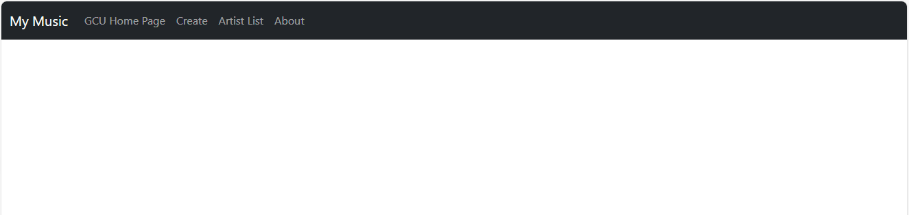
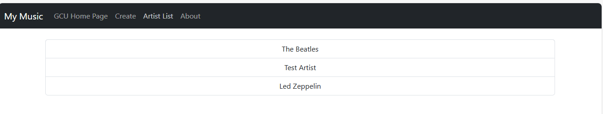
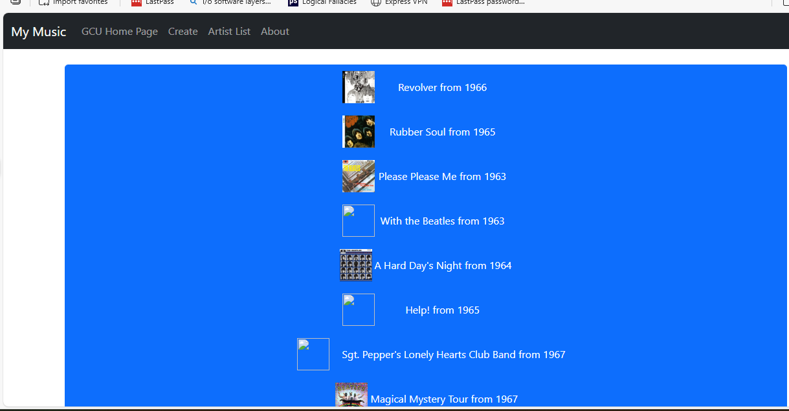
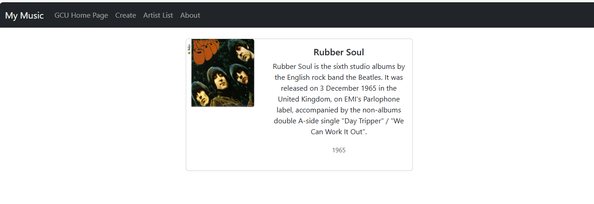
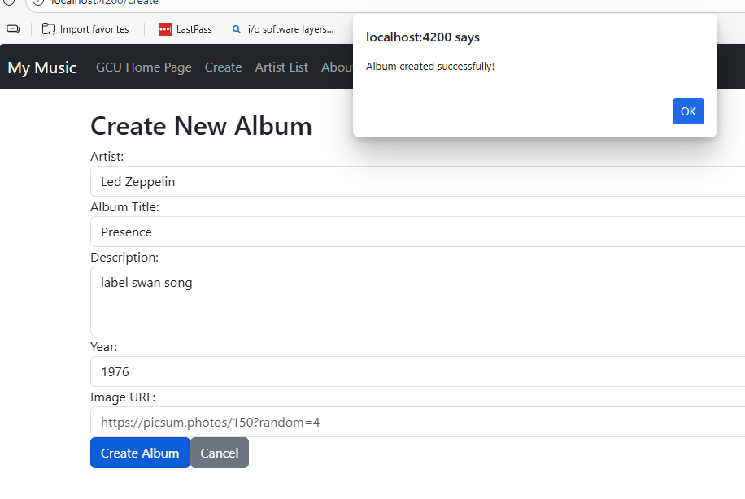

**Course:** CST-391 - JavaScript Web Application Development  
**Student:** Seline Bowens  
**Date:** February 21, 2026  
**Activity 4:** Angular Music App API Data

---

## Table of Contents
- [Introduction](#introduction)
- [Technical Overview](#technical-overview)
- [Implementation Details](#implementation-details)
- [Screenshots](#screenshots)
- [Research Question](#research-question)
- [Conclusion](#conclusion)

---

## Introduction

Activity 4 builds upon the work completed in Activities 1 and 3 by connecting the Angular frontend music application to the Express backend REST API. This integration transforms the application from using hard-coded JSON data to dynamically fetching live data from MySQL database through HTTP requests.

**Purpose:**  
The goal of this activity is to demonstrate full-stack web development by integrating a modern frontend framework (Angular) with a backend API (Node.js/Express) and database (MySQL). This mimics real-world web application architecture where the frontend and backend are separate, scalable services that communicate through RESTful APIs.

**Key Learning Objectives:**
- Implementing HTTP requests in Angular using HttpClient
- Handling callback functions in TypeScript
- Debugging frontend-backend communication
- Managing CORS (Cross-Origin Resource Sharing)
- Working with change detection in Angular

---

## Technical Overview

### Architecture

The application follows a three-tier architecture:

```
┌─────────────────────┐
│   Angular Frontend  │  Port 4200
│   (Activity 3/4)    │
└──────────┬──────────┘
           │ HTTP Requests
           │ (JSON)
           ▼
┌─────────────────────┐
│   Express Backend   │  Port 5000
│   (Activity 1)      │
└──────────┬──────────┘
           │ SQL Queries
           ▼
┌─────────────────────┐
│   MySQL Database    │  Port 3306
│   (Music DB)        │
└─────────────────────┘
```

**Frontend (Angular):**
- Angular 21 with standalone components
- TypeScript for type safety
- HttpClient for API communication
- RxJS Observables for async operations
- Bootstrap for responsive UI

**Backend (Express):**
- Node.js with Express framework
- RESTful API endpoints
- CORS enabled for cross-origin requests
- MySQL database connection

**Database (MySQL):**
- Tables: albums, artists, tracks
- Relational data structure
- CRUD operations support

---

## Implementation Details

### Changes from Activity 3

Activity 3 used hard-coded JSON data stored in the Angular application. Activity 4 replaced this with live API calls to the backend server.

**Key Modifications:**

### 1. Added HTTP Client Support

**File:** `src/app/app.config.ts`

Added `provideHttpClient()` to enable HTTP requests throughout the application:

```typescript
import { provideHttpClient } from '@angular/common/http';

export const appConfig: ApplicationConfig = {
  providers: [
    provideBrowserGlobalErrorListeners(),
    provideRouter(routes),
    provideHttpClient()  // Added for HTTP support
  ]
};
```

---

### 2. Refactored Music Service

**File:** `src/app/service/music-service.ts`

**Before (Activity 3):**
- Imported hard-coded JSON data
- Methods returned data directly
- Data stored in memory array

**After (Activity 4):**
- Injects HttpClient for API calls
- Methods use callbacks instead of direct returns
- Data fetched from backend API

**Key Changes:**

```typescript
// Removed hard-coded data import
// import * as exampledata from '../data/sample-music-data.json';

// Added HttpClient injection
constructor(private http: HttpClient) {}

// Added backend URL
private host = "http://localhost:5000";

// Changed method signatures to use callbacks
public getArtists(callback: (artists: Artist[]) => void): void {
  this.http.get<Artist[]>(this.host + "/artists")
    .subscribe((artists: Artist[]) => {
      callback(artists);
    });
}
```

**Why Callbacks?**

Angular's HttpClient uses Observables, which are asynchronous. The subscribe() method registers a callback function that executes when the HTTP request completes. 

- **Observables** can emit multiple values over time (though HTTP requests only emit once)
- **Automatic unsubscription** when using HttpClient (no memory leaks)
- **Powerful operators** for transforming and combining data streams

---

### 3. Updated Components to Use Callbacks

All components that previously called service methods directly were updated to use callback functions.

**List Artists Component:**

```typescript
// Old approach (Activity 3)
this.artists = this.service.getArtists();

// New approach (Activity 4)
this.service.getArtists((artists: Artist[]) => {
  this.artists = artists;
});
```

**List Albums Component:**

```typescript
// Old approach
this.albums = this.service.getAlbumsOfArtist(this.artist.artist);

// New approach
this.service.getAlbumsOfArtist(this.artist!.artist, (albums: Album[]) => {
  this.albums = albums;
});
```

**Create Album Component:**

```typescript
// Old approach
this.service.createAlbum(this.album);
alert('Album created successfully!');

// New approach
this.service.createAlbum(this.album, () => {
  alert('Album created successfully!');
  this.router.navigate(['list-artists']);
});
```

---

### 4. Fixed Change Detection Issue

**Problem:** Albums loaded from the backend but did not display in the UI until another action triggered Angular's change detection.

**Solution:** Injected `ChangeDetectorRef` and manually triggered change detection after receiving data:

```typescript
import { ChangeDetectorRef } from '@angular/core';

constructor(
  private service: MusicServiceService,
  private cdr: ChangeDetectorRef
) {}

ngOnInit() {
  this.service.getAlbumsOfArtist(this.artist!.artist, (albums: Album[]) => {
    this.albums = albums;
    this.cdr.detectChanges();  // Force UI update
  });
}
```

**Why This Was Needed:**

Angular's change detection runs automatically in most cases, but sometimes async operations (especially those using callbacks) does not trigger it. Manually calling `detectChanges()` ensures the view updates immediately when new data arrives.

---

### 5. Updated Album Model

**Issue:** Backend returns albums with `albumId` property, but frontend expected `id`.

**Solution:** Updated the Album model to match the backend data structure:

```typescript
export class Album {
    albumId: number;  // Changed from 'id'
    artist: string;
    title: string;
    description: string;
    year: string | number;
    image: string;
    tracks: Track[];
}
```

This demonstrates the importance of ensuring frontend and backend data contracts match.

---

## Screenshots

### 1. Main Application Screen



The initial application screen showing the dark Bootstrap navbar with navigation links 

---

### 2. Artist List Screen



The Artist List view displaying three artists loaded from the MySQL database. Each artist is displayed as a clickable button in a Bootstrap list group. 

---

### 3. Album List Screen



The Album List showing Beatles albums retrieved from the database. Each album displays its cover image and title with year (e.g., "Revolver from 1966"). The list includes 12 albums with album artwork loaded from image URLs stored in the database.

---

### 4. Album Display Screen



Detailed view of the "Rubber Soul" album displaying the album cover, title, full description, and release year (1965). This view demonstrates successful retrieval of complete album information including the description text from the MySQL database. 
---

### 5. Create Album Screen



The Create New Album form with fields for Artist , Album Title, Description, Year, and Image URL. A success alert shows "Album created successfully!" after submitting the form. 

---

## Research Question

Research how an Angular application maintains a logged-in state. How does it communicate this state to the server?

### Answer

Angular applications maintain logged-in state and communicate authentication status to servers using several approaches:

---

1. **Token-Based Authentication:**  When a user logs in successfully, the server generates a JSON Web Token (JWT) and sends it to the Angular application. The frontend stores this token and includes it with every subsequent API request.

**Process Flow:**

```
1. User Login
   ┌─────────┐           ┌─────────┐
   │ Angular │  POST     │ Express │
   │  App    │ ────────> │  API    │
   └─────────┘ email/pwd └─────────┘
                              │
                              ▼
                         Verify credentials
                              │
                              ▼
   ┌─────────┐           ┌─────────┐
   │ Angular │ <──────── │ Express │
   │  App    │   JWT     │  API    │
   └─────────┘  token    └─────────┘
        │
        ▼
   Store token
   (localStorage/
    sessionStorage)

2. Authenticated Requests
   ┌─────────┐           ┌─────────┐
   │ Angular │   GET     │ Express │
   │  App    │ ────────> │  API    │
   └─────────┘ + JWT     └─────────┘
              in header       │
                              ▼
                         Verify JWT
                              │
                              ▼
   ┌─────────┐           ┌─────────┐
   │ Angular │ <──────── │ Express │
   │  App    │   Data    │  API    │
   └─────────┘           └─────────┘
```


2. **Storage Options for Tokens:** Angular applications can store authentication tokens in several locations:

**localStorage:**
- Persists across browser sessions
- Survives page refreshes and browser restarts
- Vulnerable to XSS attacks
- Most commonly used for "Remember Me" functionality

```typescript
localStorage.setItem('authToken', token);
const token = localStorage.getItem('authToken');
localStorage.removeItem('authToken'); // Logout
```

**sessionStorage:**
- Persists only for the current browser tab/session
- Cleared when tab is closed
- Slightly more secure than localStorage
- Good for single-session logins

```typescript
sessionStorage.setItem('authToken', token);
const token = sessionStorage.getItem('authToken');
```

**In-Memory Storage (Service Variable):**
- Most secure from XSS attacks
- Lost on page refresh
- Requires additional session management
- Often combined with refresh tokens

```typescript
@Injectable({ providedIn: 'root' })
export class AuthService {
  private token: string | null = null;
  
  setToken(token: string) {
    this.token = token;
  }
  
  getToken(): string | null {
    return this.token;
  }
}
```

**HTTP-Only Cookies:**
- Most secure option (not accessible via JavaScript)
- Set by server, automatically included in requests
- Requires CORS configuration
- Resistant to XSS attacks

```typescript
// Server sets cookie
res.cookie('authToken', token, {
  httpOnly: true,
  secure: true,
  sameSite: 'strict'
});

// Browser automatically sends cookie with requests
// Angular doesn't need to manually handle it
```

3. **HTTP Interceptors:** Angular's HTTP Interceptors automatically modify outgoing requests and incoming responses. This is the standard way to add authentication headers:

**Benefits of Interceptors:**
- Centralized authentication logic
- No need to add headers to every individual request
- Easy to update authentication strategy
- Handles errors globally


4. **Auth Guards for Route Protection:** Angular's Route Guards prevent unauthorized access to specific routes:

5. **Refresh Token Strategy:** For long-lived sessions, applications use refresh tokens

- Access Token: Short-lived (15 minutes), used for API requests  
- Refresh Token:Lon g-lived (7 days), used to get new access tokens
---

### Summary

Angular applications maintain logged-in state through:

1. **Token Storage** - Storing JWT tokens in localStorage, sessionStorage, or memory
2. **HTTP Interceptors** - Automatically adding tokens to API requests
3. **Auth Guards** - Protecting routes from unauthorized access
4. **State Management** - Tracking authentication status across components
5. **Server Verification** - Backend validates tokens on every request

The server knows a user is logged in because the Angular app includes the authentication token in the `Authorization` header of every HTTP request. The server verifies this token, extracts user information, and either allows or denies the request based on the token's validity.

This stateless authentication approach scales well, supports microservices architecture, and works seamlessly with single-page applications like Angular.

---

## Conclusion

### What Was Accomplished

Activity 4 successfully integrated the Angular frontend (Activity 3) with the Express backend API (Activity 1), creating a complete full-stack music application. This integration transformed the application from a static, demo application using hard-coded data into a dynamic, production-ready system with real database connectivity.

**Key Achievements:**

**Backend Integration:**  
The application now fetches all data from the MySQL database through REST API endpoints. Instead of loading data from a JSON file at startup, the application makes HTTP requests to the Express server, which queries the database and returns current data. 

**Asynchronous Programming:**  
Working with Angular's HttpClient reinforced understanding of asynchronous programming with Observables. The callback-based approach demonstrated how JavaScript handles operations that take time to complete without blocking the user interface. 

**Change Detection:**  
Debugging the issue where albums loaded but did not display taught an important lesson about Angular's change detection system. Understanding when Angular automatically updates the view versus when manual intervention is needed (using ChangeDetectorRef) is essential for building reliable Angular applications. This debugging process demonstrated the importance of understanding framework internals rather than just following tutorials.

---