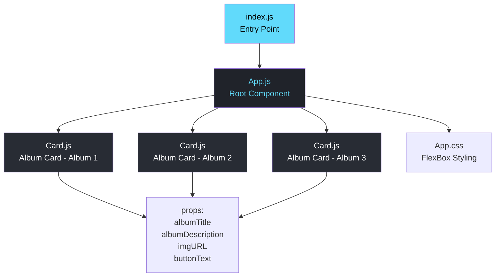
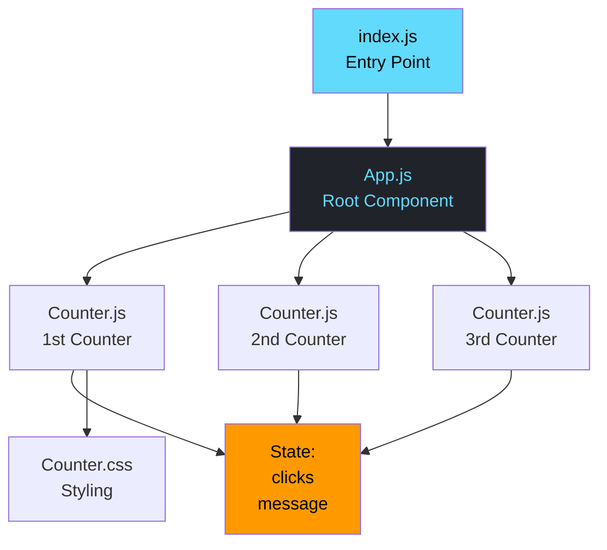
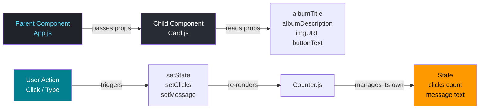
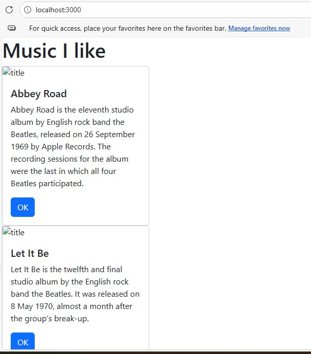
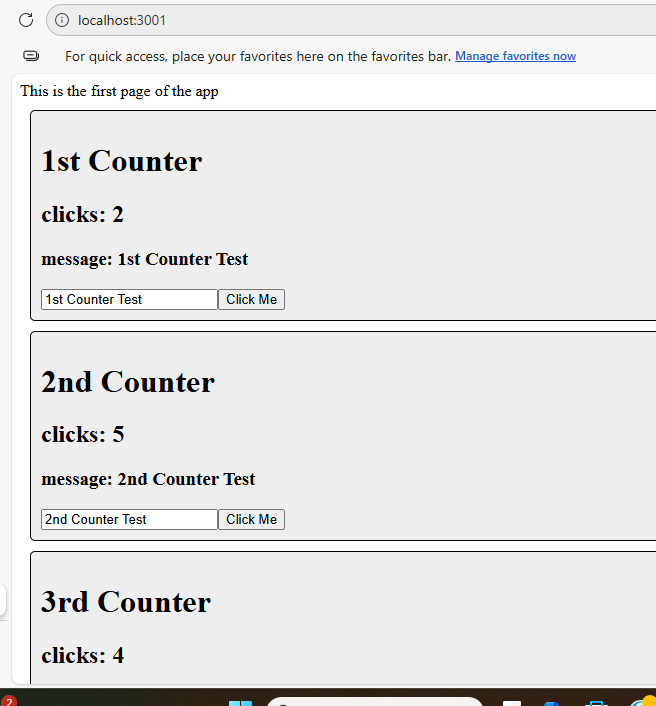
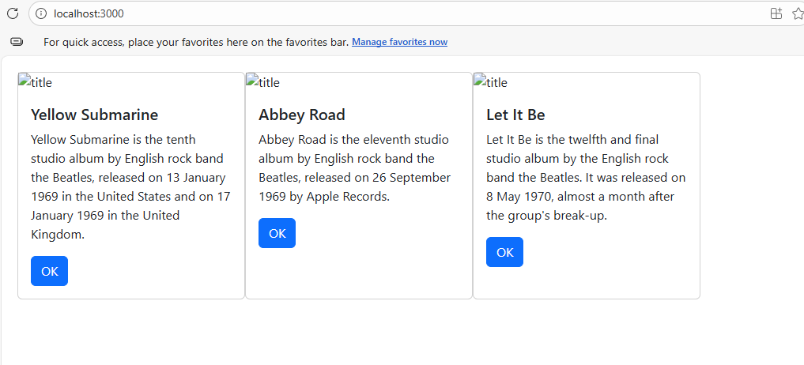

# CST-391: Activity 5
## JavaScript Web Application Development - React Tools & Music App Fixed Data

**Student:** Seline Bowens 

**Date:** 3/1/2026  

---

## Table of Contents
1. [Introduction](#introduction)
2. [Application Architecture](#application-architecture)
3. [Part 1 Summary - Custom Components](#part-1-summary---custom-components)
4. [Music App with Custom Components and Props](#music-app-with-custom-components-and-props)
5. [Mini App State Changer Summary](#mini-app-state-changer-summary)
6. [State Changer with 3 Independent Counters](#state-changer-with-3-independent-counters)
7. [Part 2 Summary - State and Props in the Music App](#part-2-summary---state-and-props-in-the-music-app)
8. [Music App with State and FlexBox Layout](#music-app-with-state-and-flexbox-layout)
9. [Conclusion](#conclusion)

---

## Introduction

Activity 5 is an introduction to React, a JavaScript library made by Facebook for building user interfaces. In this activity, I built two separate applications; a Music App and a State Changer mini app, to learn the core ideas behind how React works.

React organizes a web page into small, reusable pieces called **components**. Instead of writing one long HTML file, React lets you break the page into separate components like a Card, a Navbar, or a Counter. Each component is its own JavaScript file that controls what it looks like and how it behaves. Components can receive information from their parent using **props**, and they can track their own changing data using **state**.

This activity had two main parts. Part 1 focused on building custom components and passing data between them using props. The mini app demonstrated how state works using interactive counter boxes. Part 2 returned to the music app and applied state management using the `useState` hook to load album data from a list and display it using the `map` function.

---

## Application Architecture

### Music App Component Structure

### State Changer App Structure

### How Props and State Flow

---

## Part 1 Summary - Custom Components

In Part 1, I built a React Music App that displays album cards on the page. I started by learning how JSX works. It looks like HTML but it is actually JavaScript that React uses to describe what the page should look like. Every JSX element must have one single parent element wrapping it, and some HTML attributes are written differently in JSX, for example `class` becomes `className` and inline styles use double curly braces like `style={{width: '18rem'}}`.

I learned how to create a custom component by moving the card code into its own file called `Card.js`. This is better than copying and pasting the same card HTML three times because if the design changes, I only need to update one file. I then learned how to pass data into a component using **props**. Props are like arguments you pass into a function; the parent component (App.js) sets the props, and the child component (Card.js) reads them using `props.albumTitle`, `props.albumDescription`, and so on. Finally, I separated the App function into its own `App.js` file to keep the code clean and organized, which is a standard React practice.

**New terms learned:**
- **Component** - a reusable piece of the UI written as a JavaScript function
- **Props** - data passed from a parent component to a child component
- **export default** - makes a component available to be imported by other files
- **Arrow function** - a shorter way to write a JavaScript function using `() =>`

---

## Music App with Custom Components and Props 
The music app showing Bootstrap cards rendered using the reusable Card component. Each card displays album title, description, and an OK button using props passed from App.js.

---

## Mini App State Changer Summary

The State Changer mini app was built to demonstrate the difference between **props** and **state** in React. Props are values set by the parent and do not change inside the child component. State, on the other hand, is data that a component manages itself and can change over time based on user actions.

React manages state using **hooks**. A hook is a special function built into React that lets a component remember and update its own data. The hook used is called `useState`. When you call `useState(0)`, React gives you two things; the current value (like `clicks`) and a function to change it (like `setClicks`). Every time `setClicks` is called, React automatically re-renders the component to show the updated value on the screen.

The Counter component showed two independent state values; one for counting clicks and one for tracking what the user types in the input box. Each Counter box on the page has its own separate state, meaning clicking one counter does not affect the others.

**New terms learned:**
- **State** - data that a component manages and can change over time
- **Hook** - a built-in React function that lets components use features like state
- **useState** - the hook used to create and update state in a functional component
- **Controlled component** - an input field whose value is tied to a state variable
- **Re-render** - when React updates the screen after a state change

---

### State Changer with 3 Independent Counters
The State Changer app showing three Counter components, each with its own click count and message state. The 1st Counter has been clicked 2 times, 2nd Counter 5 times, and 3rd Counter 4 times. Each counter's message was also updated by typing in the input field, demonstrating that state is independent per component.

---

## Part 2 Summary - State and Props in the Music App

In this part, I returned to the music app and applied the state concepts learned in the mini app. The album data was moved from hardcoded `<Card />` tags into a state variable called `albumList` using `useState`. This is important because in future activities, `albumList` will be updated dynamically from a REST API instead of being hardcoded. The **map function** is used to transform every item in an array into something new. In this case, the `renderedList` function used `.map()` to loop through every album in `albumList` and return a `<Card />` component for each one. This is much cleaner than writing a `<Card />` tag manually for every album.

I also added CSS FlexBox styling in `App.css` to make the cards display horizontally side by side instead of stacking vertically. The `display: flex` and `flex-wrap: wrap` properties tell the browser to arrange the cards in a row and wrap them to the next line if the screen is too narrow.

**New terms learned:**
- **useState** — used here to store the album list as a state variable ready for future API updates
- **map function** — transforms each item in an array into a new value or JSX element
- **FlexBox** — a CSS layout system for arranging items in rows or columns
- **flex-wrap** — allows flex items to wrap onto the next line when there is not enough space

---

### Music App with State and FlexBox Layout 
The music app updated to use useState for the album list and the map function to render cards. Cards now display horizontally side by side using CSS FlexBox. 

---

## Conclusion

Activity 5 introduced React and taught the core ideas that make it different from plain HTML and JavaScript. By breaking the page into components, the code becomes easier to read, reuse, and maintain. Instead of copying card HTML three times, one Card component handles all three albums. Instead of manually updating the screen when data changes, React automatically re-renders the component whenever state changes.

The biggest lesson from this activity is understanding the difference between props and state. Props are information passed down from a parent that the child component reads but does not change. State is data that the component owns and can update itself based on what the user does. Together, props and state are how React manages all the data and behavior in a UI.

The map function was another important concept — it shows how to work with arrays in React by turning a list of data objects into a list of components. This pattern will be used again in future activities when album data comes from a live REST API instead of a hardcoded array. Activity 5 laid the foundation for understanding how React applications are structured and how data flows through them.

---