# CST-391: Activity 6
## JavaScript Web Application Development - React Music App API Data

**Student:** Seline Bowens  
**Date:** 3/8/2026

---

## Table of Contents
1. [Introduction](#introduction)
2. [Part 3 Summary - JSON, Search, and Axios](#part-3-summary---json-search-and-axios)
3. [Part 3 Screenshots](#part-3-screenshots)
4. [Mini App #2 Summary - React Router](#mini-app-2-summary---react-router)
5. [Mini App #2 Screenshots](#mini-app-2-screenshots)
6. [Part 4 Summary - Routing in the Music App](#part-4-summary---routing-in-the-music-app)
7. [Part 4 Screenshots](#part-4-screenshots)
8. [Conclusion](#conclusion)

---

## Introduction

Activity 6 builds on the React music app from Activity 5 and introduces three important new ideas which are; loading data from an external source using Axios, filtering that data using a search form, and navigating between different pages using React Router.

In Part 3, the hard-coded album data was moved from the component state into a JSON file, and then replaced entirely with live data fetched from the Express REST API built in Activity 1. A search form was added so users can filter albums by description. In Mini App #2, a separate routing app was built from scratch to practice using React Router with login protection, private routes, and a navigation bar. In Part 4, these routing concepts were applied to the music app itself, giving it a proper multi-page structure with a NavBar, an album list page, a search page, and an album details page.

---

## Part 3 Summary - JSON, Search, and Axios

In Part 3, the music app was updated in three stages. First, the album data that was previously stored directly inside `App.js` as a hard-coded array was moved into a separate `albums.json` file. The app then imported that file and used `useEffect` to load it into the `albumList` state when the page first opens, which made the data easier to manage. Then, a search form was added to the app. The `SearchForm` component accepts text input from the user and passes it back to `App.js` using a function called `updateSearchResults`. The `renderedList` function was updated to filter albums using `.filter()`, only showing cards whose descriptions contain the search phrase. If the search box is empty, all albums are shown. Finally, the hard-coded JSON file was replaced with a live API connection using Axios. A `dataSource.js` file was created to configure Axios with the Express API base URL. The `loadAlbums` function uses `dataSource.get('/albums')` to fetch real album data from the MySQL database. This is the same API backend built in Activity 1, now being consumed by the React frontend.

**New terms learned:**
- **useEffect** - a React hook that runs code when the component first loads or when a value changes
- **Axios** - a JavaScript library used to make HTTP requests to a REST API
- **async/await** - a way to write code that waits for data before continuing
- **filter()** - a JavaScript array method that returns only items that match a condition

---

## Part 3 Screenshots

### Music App with Real Album Data from API

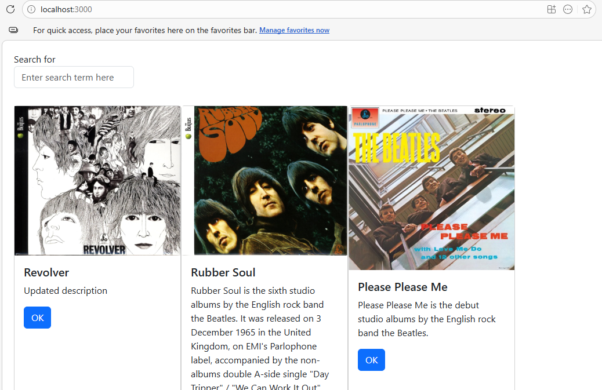

The music app showing album cards loaded from the MySQL database via the Express REST API using Axios. Each card shows the album cover image, title, description, and an OK button. The search form at the top is ready to filter results.

---

### Search Filtering Albums by Keyword

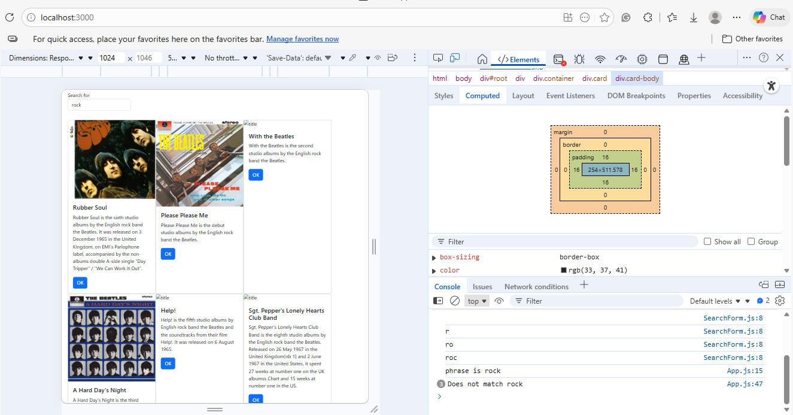

The search form filtering albums by the word "rock". Only albums whose descriptions contain that word are displayed. The browser console shows the search phrase being logged and albums that do not match being excluded. The responsive layout adjusts to show fewer cards when results are filtered.

---

### Search Returning a Single Match

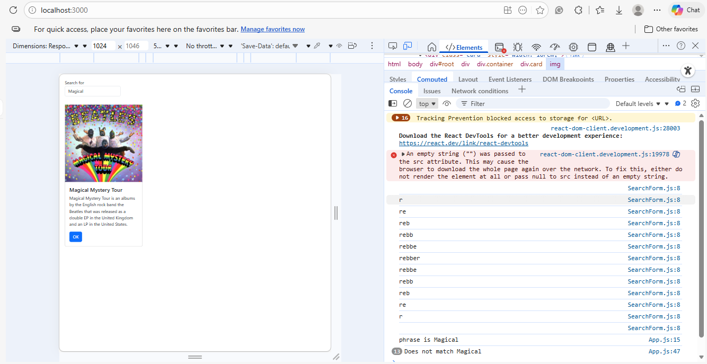

Searching for the word "Magical" returns only one album — Magical Mystery Tour. The console shows 13 albums that did not match being logged as "Does not match Magical". This confirms the filter is working correctly against all albums in the database.

---

## Mini App #2 Summary - React Router

Mini App #2 was a separate React application built specifically to learn how React Router works. React Router allows a single-page React app to behave like it has multiple pages. Clicking a link changes what is shown on screen without actually reloading the browser. The app included a NavBar with links to About, Contact Us, User, and Login pages. Each link pointed to a different route, and React Router matched the URL to the correct component to display. A `PrivateRoute` component was also created to protect certain pages so that if a user was not logged in, they were redirected to the login page instead of being allowed to see protected content.

The User page demonstrated dynamic routing by reading a name from the URL. Clicking on a friend's name in the list updated the URL and displayed a personalized greeting like "Hello Brianna". This showed how route parameters work in React Router.

**New terms learned:**
- **React Router** - a library that lets React apps show different components based on the URL
- **PrivateRoute** - a custom route that checks if the user is logged in before showing the page
- **useNavigate** - a React Router hook used to move to a different page from inside a component
- **Route parameter** - a variable part of the URL, like `/user/Brianna`, that the component can read

---

## Mini App #2 Screenshots

### Login Page with Friends List

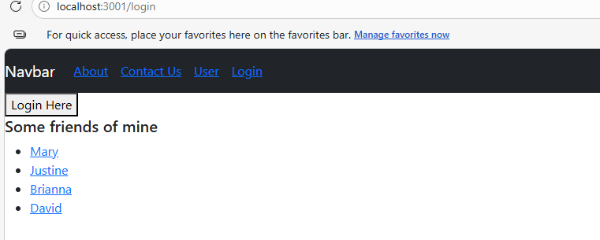

The Mini App login page with the NavBar showing links for About, Contact Us, User, and Login. A "Login Here" button is visible and the friends list is loaded from the User.js component, displayed as clickable links.

---

### Home Page (Default Route)

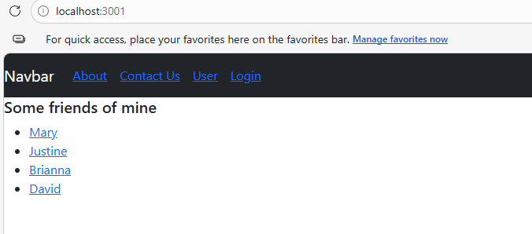

The Mini App home page at localhost:3001 showing the default route. The NavBar is visible at the top. The friends list is displayed, demonstrating that the User component is rendered on the default route. No special page content is shown. This is the starting state of the app.

---

### About Page

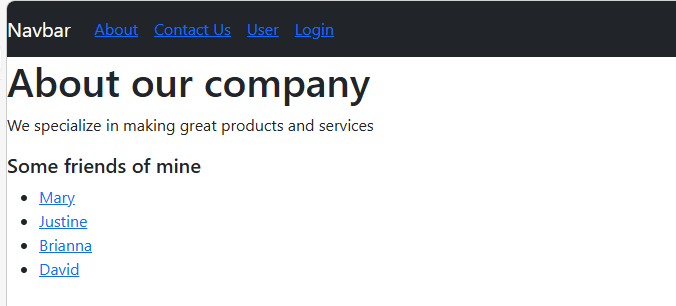

The About page showing company information: "About our company - We specialize in making great products and services."  when "About" is clicked on the NavBar, confirming that routing works correctly and the NavBar component persists across all pages. 

---

### Contact Us Page

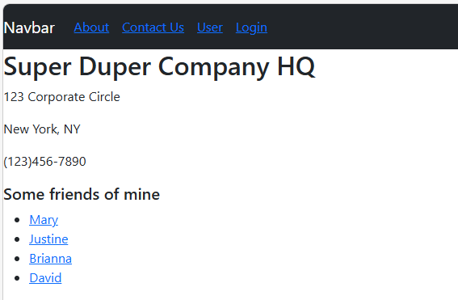

The Contact Us page showing company contact details. This page is rendered by the ContactUs.js component when the user clicks the Contact Us link in the NavBar.

---

### User Page with Default Name

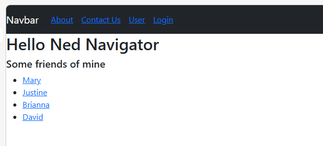

The User page showing "Hello Ned Navigator". The default name displayed when no specific friend has been selected from the list. This is the starting state of the /user route before a name is clicked.

---

### User Page with Dynamic Route Parameter

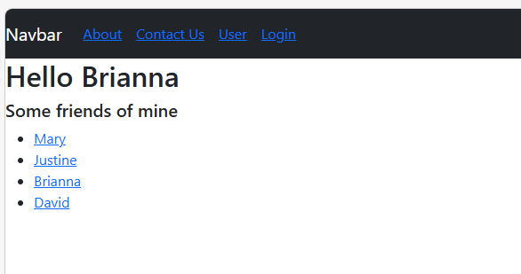

The User page showing "Hello Brianna" after clicking the name Brianna from the friends list. This demonstrates how React Router route parameters work. The URL changes to include the name, and the component reads it to display a personalized message.

---

## Part 4 Summary - Routing in the Music App

In Part 4, the routing concepts from Mini App #2 were applied to the music app. A proper multi-page structure was added using React Router with four main routes: a main search page, a single album details page, a new album form page, and a navigation bar. The NavBar component was created with "My Music", "Main", and "New" links. The Main link leads to the `SearchAlbum` page which shows the search form and album cards. Clicking the OK button on any card calls the `updateSingleAlbum` function which saves the selected album to state and navigates to the `OneAlbum` route. The `OneAlbum` component displays the album's image, title, description, and placeholders for tracks, lyrics, and video. The `NewAlbum` component was created as a stub showing "This is a New Album Form".

The key challenge solved in this activity was wiring the OK button correctly. The button needed to pass `albumId` up through `AlbumList.js` to `App.js`, which then used `useNavigate` to redirect to the album details page. The `Card.js` component was also fixed to use `{props.imgURL && }` so that albums with no image in the database do not cause browser errors.

**New terms learned:**
- **updateSingleAlbum** - a function that stores the clicked album and navigates to its detail page
- **useNavigate** - used inside child components to trigger navigation back in the parent
- **Conditional rendering with &&** - renders an element only when the condition is true

---

## Part 4 Screenshots

### Music App with NavBar and Album Cards

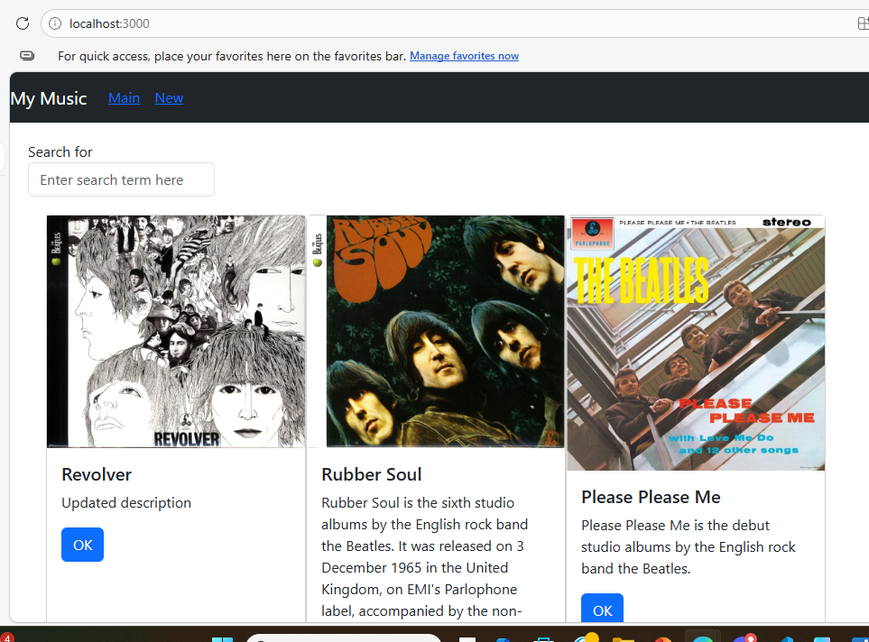

The completed music app with the "My Music" NavBar showing Main and New links. Albums from the MySQL database are displayed as cards with cover images, titles, descriptions, and OK buttons. The search form is at the top. This is the main page of the Part 4 music app.

---

### Album Details Page (OneAlbum)

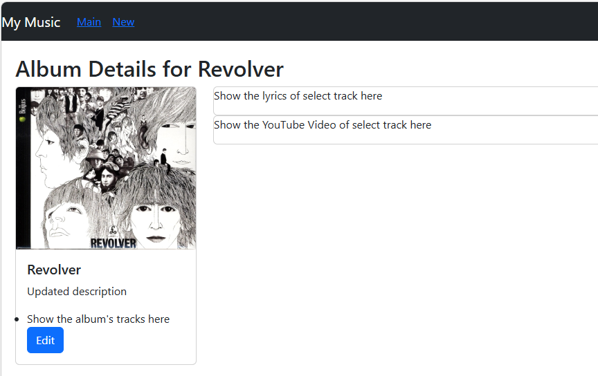

The Album Details page for Revolver, reached by clicking the OK button on a card. The page shows the album cover image, title "Album Details for Revolver", description, and an Edit button on the left. On the right side are placeholder text fields for showing track lyrics and a YouTube video. This demonstrates that React Router navigation from the album list to the detail page is working correctly.

---

### New Album Form Page
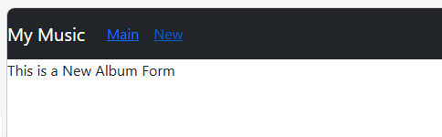

The New Album Form page reached by clicking the "New" link in the NavBar. The page shows "This is a New Album Form" as a placeholder, confirming that the route is correctly connected in App.js and the NavBar navigation is fully working across all pages.

## Conclusion

Activity 6 connected all the React concepts from previous activities into a real, working application that talks to a live database. What was learned was how data flows in a React app from the database, through the API, through Axios, into component state, and finally rendered on screen through multiple nested components.

React Router gave the app a proper multi-page structure without ever actually reloading the browser. Each URL maps to a different component, and state is passed between pages using functions and route parameters. The Mini App #2 was especially helpful for understanding how private routes protect pages from users who are not logged in.

---