# CST-391: Activity 7
## JavaScript Web Application Development - React Music App Completion

**Student:** Seline Bowens

**Date:** 3/11/2026

---

## Table of Contents
1. [Introduction](#introduction)
2. [Application Architecture](#application-architecture)
3. [Mini App #3 Summary - Blog App](#mini-app-3-summary---blog-app)
4. [Mini App #3 Screenshots](#mini-app-3-screenshots)
5. [Part 6 Summary - Create New Album](#part-6-summary---create-new-album)
6. [Part 6 Screenshots](#part-6-screenshots)
7. [Part 7 Summary - Edit an Album](#part-7-summary---edit-an-album)
8. [Part 7 Screenshots](#part-7-screenshots)
9. [Installation & Setup](#installation--setup)
10. [Conclusion](#conclusion)

---

## Introduction

Activity 7 builds on the music app from Activity 6 and introduces two new features: creating new albums and editing existing ones. Before building these features in the music app, a smaller Blog App was created as Mini App #3 to practice the core skills needed, specifically how to dynamically add and remove items from a list using React state.
The Blog App showed how a parent component can manage a list in state and pass down functions to child components so they can trigger updates. These same ideas were then applied to the music app. Part 6 replaced the stub New Album form with a fully working form that sends data to the Express API using an HTTP POST request. Part 7 extended that form into a more flexible EditAlbum component that handles both creating and editing albums, using POST for new albums and PUT for existing ones.

---

## Application Architecture

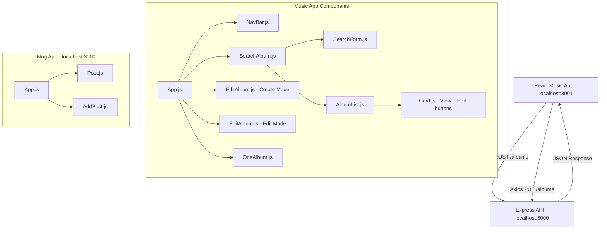
---

## Mini App #3 Summary - Blog App

Mini App #3 is a small blog application that demonstrates how to dynamically add and remove items from a list in React. The app starts with three hard-coded blog posts stored in the `postList` state array in `App.js`. Each post is displayed using a `Post` component that shows the entry number, the post text, and a Delete button.

When the Delete button is clicked, the `handleDeletePost` function in `App.js` uses the `.filter()` method to create a new list that excludes the deleted post. React then automatically re-renders the page to reflect the change. At the bottom of the page, an `AddPost` component provides a text area and an Add button. When the user types something and clicks Add, the `handleAddPost` function creates a new post object and adds it to the list using the spread syntax `[...postList, newPost]`. A separate `postId` state variable keeps track of the next ID number to assign.

This exercise demonstrated the pattern used throughout the music app. The parent component owns and manages the list in state, while child components receive functions as props to communicate changes back up to the parent.

**New terms learned:**
- **Controlled component** - a form element whose value is controlled by React state, updated on every keystroke
- **Spread syntax (`...`)** - expands an array into individual items, used here to add a new item without mutating the original array
- **filter()** - returns a new array containing only items that pass a condition, used here to remove a deleted post
- **Callback prop** - a function passed from parent to child so the child can trigger a state update in the parent

---

## Mini App #3 Screenshots

### Blog App Initial Single Post

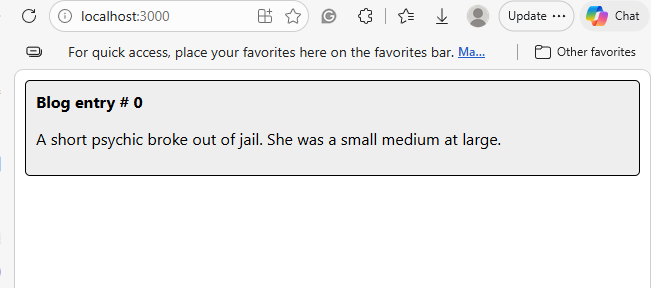

The blog app showing the initial single hard-coded post. This is the first stage of the app before the map function and multiple posts were added.

---

### Blog App with Three Posts Using Map

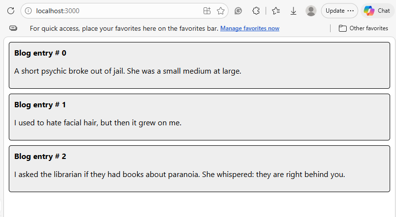

The blog app updated to show three posts using the `.map()` function. Blog entries 0, 1, and 2 are all displayed from the `postList` state array. This demonstrates how the map function transforms an array of data into an array of React components.

---

### Blog App with Delete Buttons and Add Form

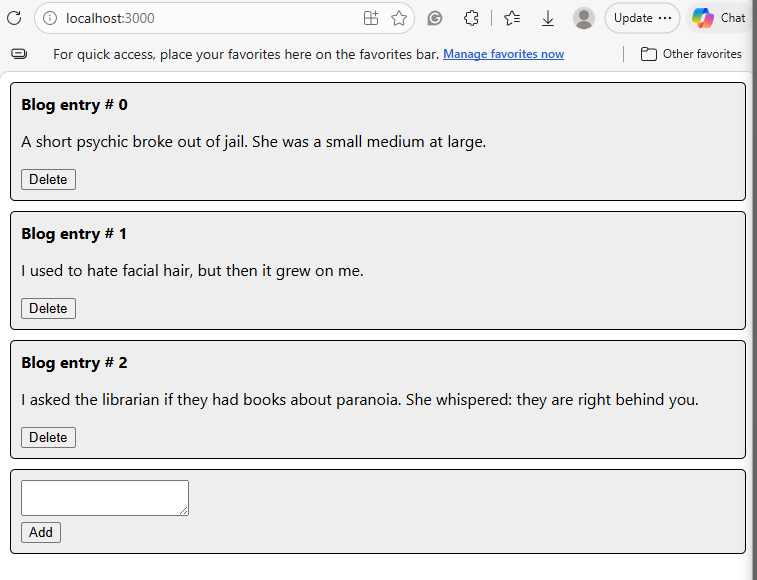

The blog app with Delete buttons added to each post and the AddPost form at the bottom. The textarea and Add button allow users to type new blog entries. Each post now has a Delete button that calls the `handleDeletePost` function in App.js when clicked.

---

### Blog App After Adding a New Post

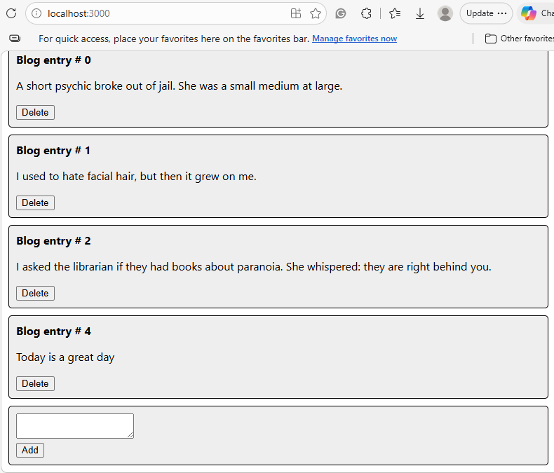

The new post appears as Blog entry #4 at the bottom of the list with its own Delete button. The postId state automatically incremented to assign the correct ID number.

---

## Part 6 Summary - Create New Album

In Part 6, the stub `NewAlbum.js` placeholder from Activity 6 was replaced with a fully working form. The form uses Bootstrap styling and includes input fields for Album Title, Artist, Description, Year, and Image URL. Each input field is a controlled component, and its value is tied to a state variable using `useState`, and an `onChange` handler updates the state on every keystroke.

When the Submit button is clicked, the `handleFormSubmit` function runs. It builds an album object from the current state values and passes it to the `saveAlbum` function. The `saveAlbum` function uses Axios to send an HTTP POST request to the Express API at `/albums`, saving the new album to the MySQL database. After saving, it calls `props.onNewAlbum(navigate)` which triggers the parent `App.js` to reload the album list and navigate back to the main page. A Cancel button uses `useNavigate` to return to the main page without saving.

**New terms learned:**
- **Controlled form component** - each input's value is bound to state so React always knows the current content
- **event.preventDefault()** -  stops the browser from reloading the page when a form is submitted
- **Axios POST** - sends new data to the API to be saved to the database
- **useNavigate** - a React Router hook used to programmatically change the page

---

## Part 6 Screenshots

### Create Album Form Filled In


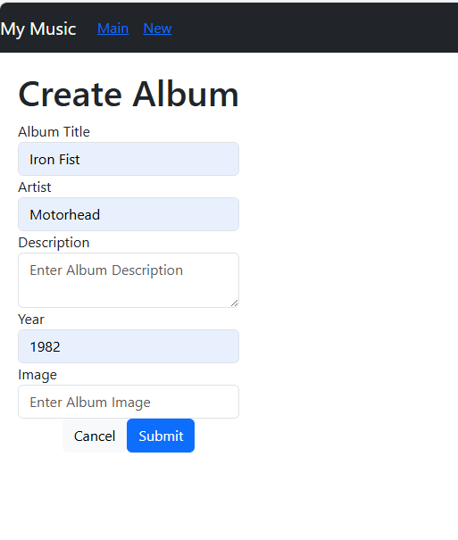

The Create Album form filled in with newly created data.

---

### Album Details After Creating

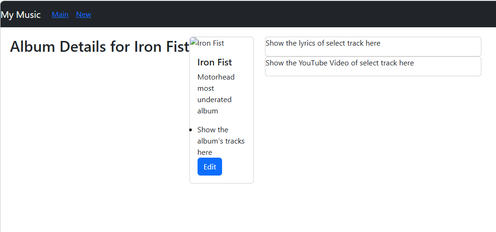

The Album Details page for the newly created Iron Fist album after the form was submitted. The album was saved to the MySQL database and the app automatically navigated to the details page showing the title, artist, description, and placeholders for tracks and video.

---

### Main Page Showing New Album

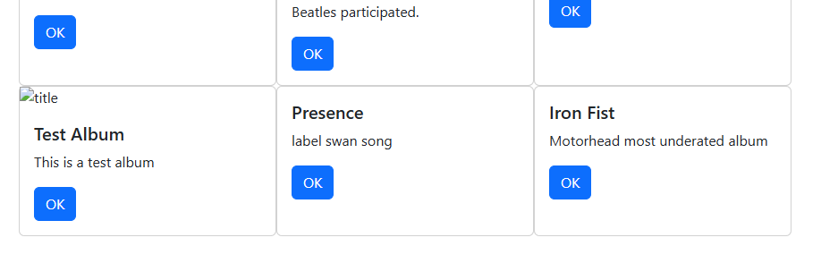

The main album list page showing the newly created Iron Fist album appearing alongside other albums. This confirms the album was successfully saved to the database and that the `loadAlbums` function correctly refreshed the list after submission.

---

## Part 7 Summary - Edit an Album

In Part 7, the `NewAlbum.js` file was renamed to `EditAlbum.js` and modified to handle both creating and editing albums in a single component. The key idea is that if `props.album` is provided, the component is in edit mode; otherwise it is in create mode. A flag called `newAlbumCreation` tracks which mode is active. When in edit mode, the form fields are pre-filled with the existing album's data by passing `album.title`, `album.artist`, and so on as the initial values to `useState`. The page title switches between "Create New Album" and "Edit Album" using a ternary expression. When the form is submitted, the `saveAlbum` function checks the `newAlbumCreation` flag. If true it sends a POST request, and if false it sends a PUT request to update the existing record.

The `Card.js` component was updated to show two buttons: a View button that navigates to `/show/` and an Edit button that navigates to `/edit/`. The `updateSingleAlbum` function in `App.js` was updated to accept a `uri` parameter so it knows which path to navigate to. Two routes were added in `App.js`. One for create mode and one for edit mode, both using the same `EditAlbum` component.

**New terms learned:**
- **Ternary expression** - a shorthand if/else written as `condition ? valueIfTrue : valueIfFalse`
- **Axios PUT** - sends updated data to the API to modify an existing database record
- **Route parameter** - a variable part of the URL like `/edit/:albumId` that identifies which album to edit
- **Single component, dual mode** - one component that behaves differently depending on what props it receives

---

## Part 7 Screenshots

### Edit Album Form Pre-filled

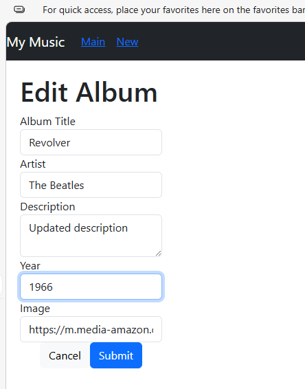

The Edit Album form for the Revolver album, pre-filled with its existing data. The page title shows "Edit Album" instead of "Create New Album", confirming the component detected the existing album in props.

---

### Album Details After Editing

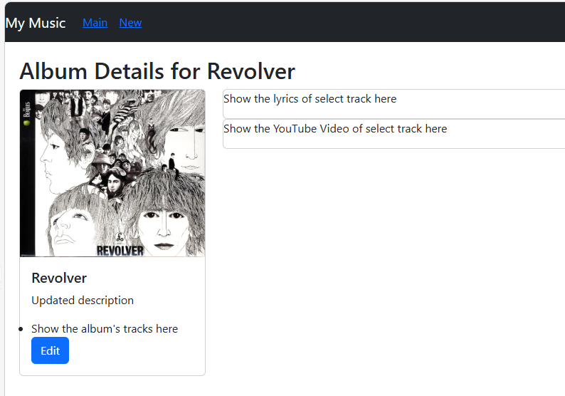

The Album Details page for Revolver before the edit was submitted. 

---

### Main Page with View and Edit Buttons

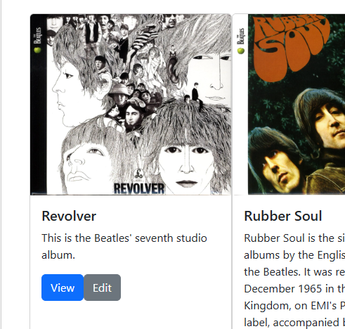

The main album list showing the updated Revolver description "This is the Beatles' seventh studio album." confirming the PUT request successfully updated the record in the MySQL database. The album image and all other details are displayed correctly. Each card now has two buttons: a blue View button that navigates to the album details page and a grey Edit button that opens the Edit Album form pre-filled with that album's data.

---

## Installation & Setup

### Blog App (Mini App #3)
```bash
cd C:\git\cst391\activities\activity7\blog
npm install
npm start
```
Opens at `http://localhost:3000`

### Music App (Part 6 & Part 7)

**Step 1 - Start the Express API:**
```bash
cd C:\git\cst391\activities\activity1\MusicAPI
npm run start
```
API runs at `http://localhost:5000`

**Step 2 - Start the music app:**
```bash
cd C:\git\cst391\activities\activity7\music
npm install
npm start
```
Opens at `http://localhost:3001`

---

## Conclusion

Activity 7 completed the core CRUD operations of the music app. Users can now create new albums using a form that sends data to the database, view album details, and edit existing albums with changes saved back to the database. The same `EditAlbum` component handles both operations by checking whether an album was passed in props, which keeps the code clean and avoids duplication.

The Blog App mini exercise demonstrated the exact same pattern in a simpler context first managing a dynamic list with add and delete operations, passing callback functions from parent to child, and using the spread syntax to update arrays in state without mutation. These same ideas directly powered the music app's create and edit functionality.
