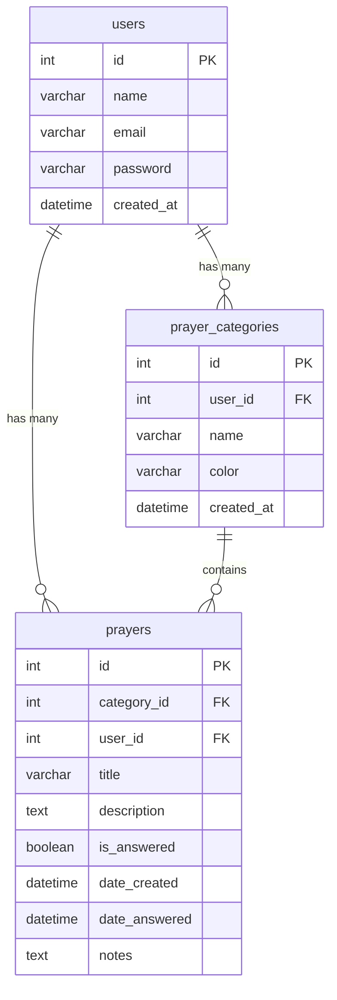
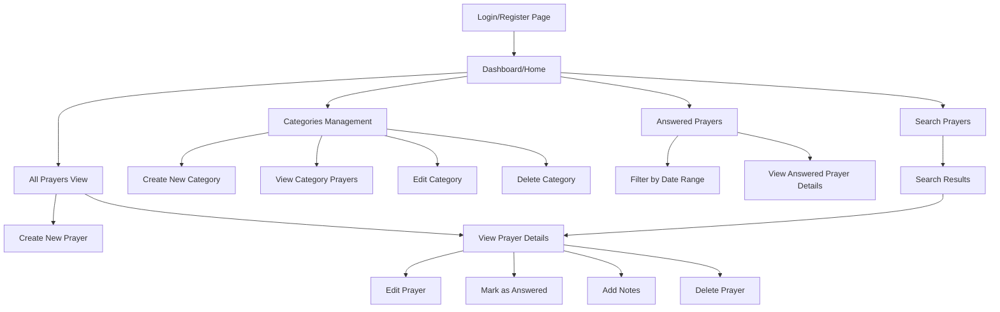
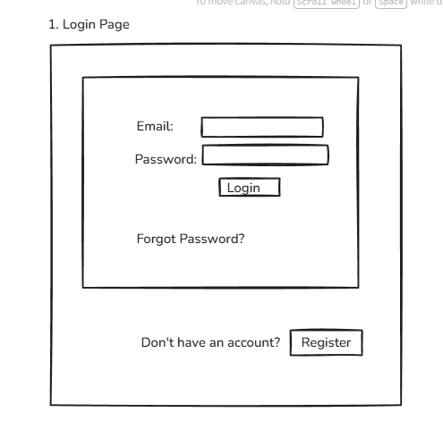
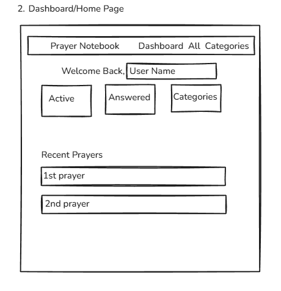
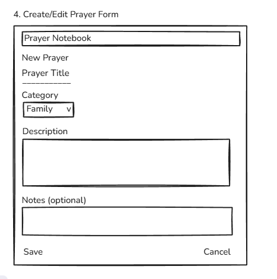
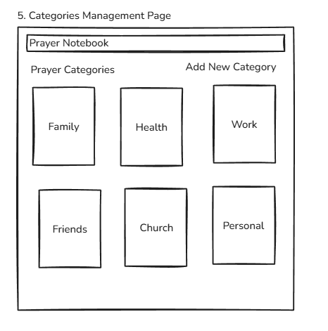
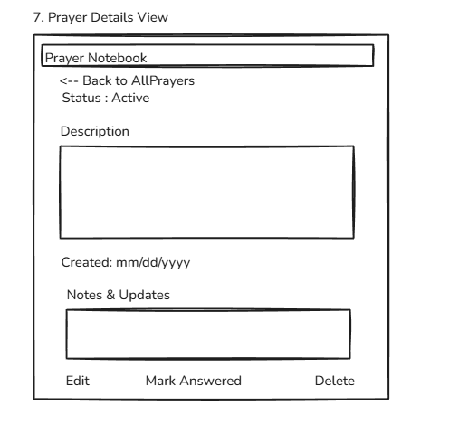
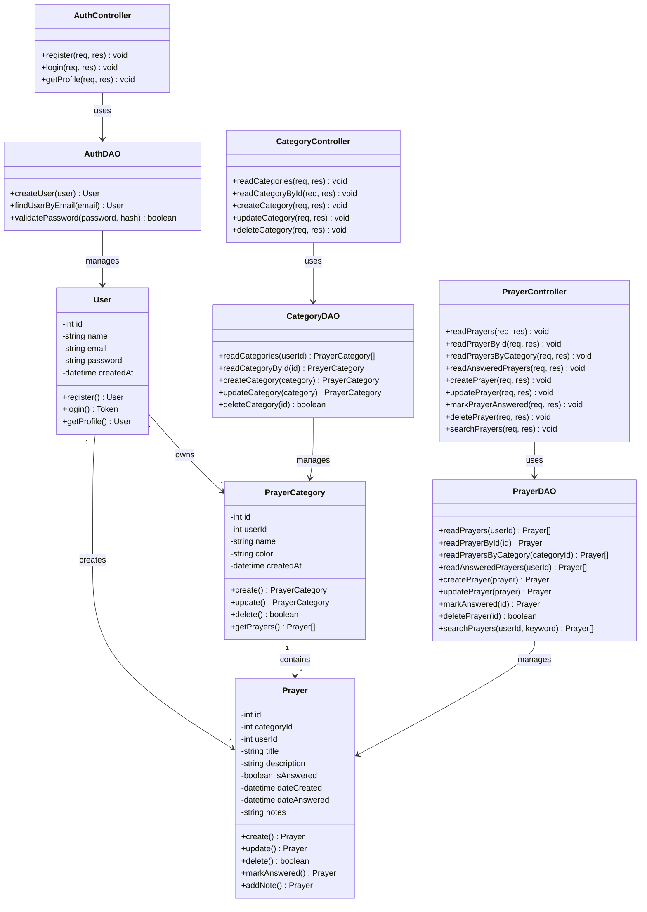

# CST-391: Milestone 1
## JavaScript Web Application Development

**Application Name:** Prayer Notebook  
**Author:** Seline Bowens
**Date:** 2/3/2026  

---

## Prayer Notebook Application

Prayer Notebook is a web-based application designed to help Christians organize and track their prayer life. The application allows users to create, categorize, and manage prayer requests, making it easier to maintain a consistent and organized prayer routine. The application addresses the common challenge many believers face in keeping track of prayer requests from family, friends, church, and personal needs. By providing a digital notebook specifically for prayers, users can organize requests by category, add detailed notes, and mark prayers as answered to see God's faithfulness over time.
This project will demonstrate web development skills by implementing a RESTful API using Node.js and Express, a MySQL database for data persistence, and responsive front-end applications using both React and Angular frameworks.

---

## Functionality Requirements

### User Stories

1.	Users to be able to create a new prayer request, so that they can remember to pray for specific needs.

2.	Users to be able to organize their prayers into categories such as Family, Friends, Church, Health, and Work, so that they can keep their prayer life organized.

3.	Users to be able to view all their prayer requests in a list, so that they can see what they need to pray for.

4.	Users can view prayers within a specific category, so that they can focus on one area of prayer at a time.

5.	Users can edit an existing prayer request, so that they can add updates or corrections.

6.	Users can mark a prayer as answered, so that they can track God's faithfulness and see answered prayers.

7.	Users can add notes or updates to a prayer request, so that they can document how the situation is progressing.

8.	Users can delete a prayer request, so that they can remove prayers that are no longer relevant.

9.	Users can view all answered prayers, so that they can be encouraged by seeing how God has worked.

10.	Users can search for specific prayers by keyword, so that they can quickly find a particular request.

---

## Initial Database Design

### Entity Relationship Diagram

### Database Tables

**users**
- `id` (INT, Primary Key, Auto-increment)
- `name` (VARCHAR(100))
- `email` (VARCHAR(100), UNIQUE)
- `password` (VARCHAR(255))
- `created_at` (DATETIME)

**prayer_categories**
- `id` (INT, Primary Key, Auto-increment)
- `user_id` (INT, Foreign Key → users.id)
- `name` (VARCHAR(50))
- `color` (VARCHAR(20))
- `created_at` (DATETIME)

**prayers**
- `id` (INT, Primary Key, Auto-increment)
- `category_id` (INT, Foreign Key → prayer_categories.id)
- `user_id` (INT, Foreign Key → users.id)
- `title` (VARCHAR(200))
- `description` (TEXT)
- `is_answered` (BOOLEAN)
- `date_created` (DATETIME)
- `date_answered` (DATETIME, nullable)
- `notes` (TEXT)

---

## Initial UI Sitemap

### Application Navigation Flow

---

## UI Wireframes

### 1. Login Page
User authentication page with email and password fields.

---

### 2. Dashboard/Home Page
Main landing page after login with statistics and recent prayers overview.

---

### 3. All Prayers List Page
Complete list of active prayer requests with filtering and sorting options.

---

### 4. Create/Edit Prayer Form
Form for adding new prayers or editing existing ones.

---

### 5. Categories Management Page
View and manage prayer categories.

---

### 6. Answered Prayers Page
Historical view of answered prayers with date filtering.

---

### 7. Prayer Details View
Detailed view of a single prayer with all information and actions.

---

### 8. Search Results Page
Display search results based on keyword queries.

---

## UML Classes

### UML Class Diagram

---

## Risks

1. **Authentication Security**: Improper password storage or JWT token handling could lead to security vulnerabilities.  

2. **Database Performance**: Slow query performance with large amounts of prayer data.  

3. **Frontend Framework Complexity**: Building two different frontends (React + Angular) doubles development time.  

4. **Data Validation**: Invalid or malicious data could corrupt database or cause errors.  

5. **Time Management**: Underestimating time needed for backend, frontend, and testing.  

6. **Learning Curve**: Limited experience with React or Angular could slow development.  
