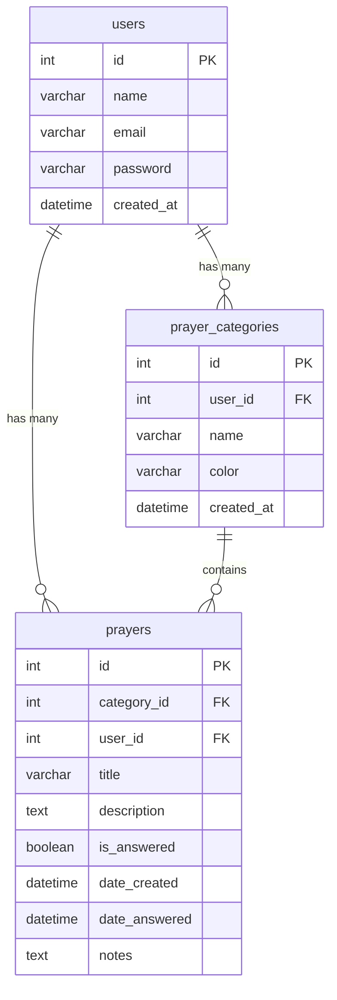
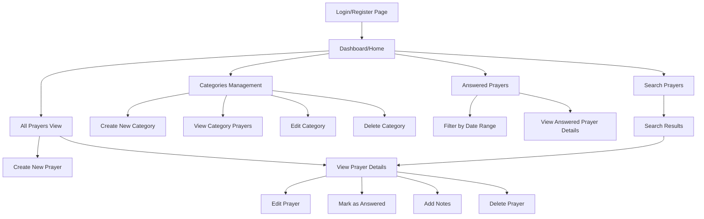
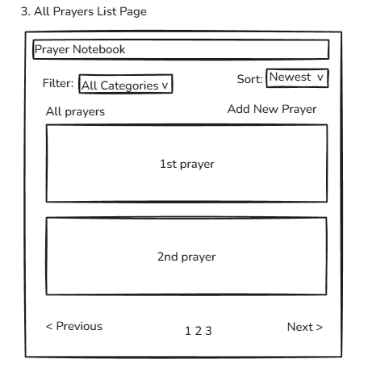
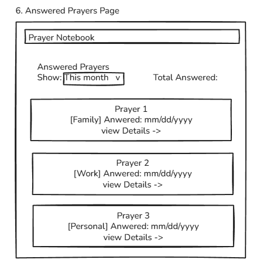
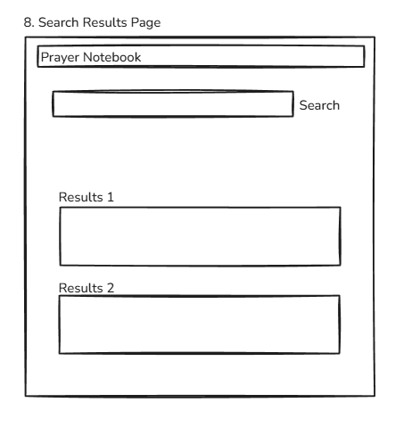
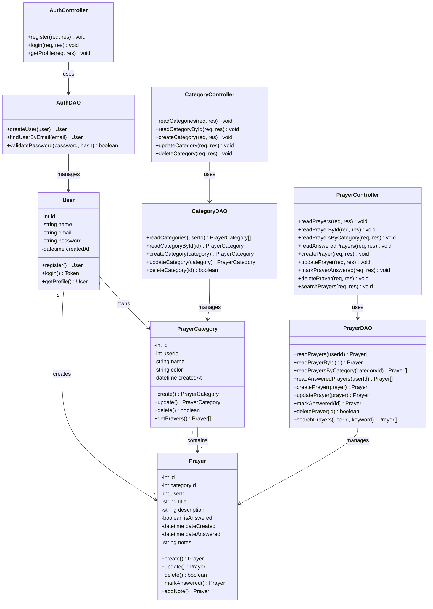

# CST-391: Milestone 2
## JavaScript Web Application Development

**Application Name:** Prayer Notebook  
**Author:** Seline Bowens  
**Date:** February 8, 2026  

---

## Instructor Feedback and Response

### Instructor Feedback

"YOU MORE THAN MET THE REQUIREMENTS!!! WOW, WOW, WOW. i hope you see the difference. Now continue to do this type of work on all your assignments, not just this course and past courses. Get your profile going and then WATCH the companies want to hire you on the SPOT. THEY WILL FANTASTIC WORK!!! i AM SO PROUD OF YOU. Bobby :-)"

### Response to Feedback

Thank you for the encouraging feedback! I am committed to maintaining this high standard of work across all my assignments and future projects. Based on your feedback, I have Maintained the comprehensive documentation approach. I will continue to provide detailed explanations, diagrams, and thorough planning in all future milestones. I am building my portfolio with well-documented projects that showcase both technical skills and communication abilities. I appreciate your guidance and will carry this level of excellence forward in all my coursework and professional development.

---

## Table of Contents
1. [Introduction](#introduction)
2. [Functionality Requirements](#functionality-requirements)
3. [REST API Design](#rest-api-design)
4. [Initial Database Design](#initial-database-design)
5. [Initial UI Sitemap](#initial-ui-sitemap)
6. [Initial UI Wireframes](#initial-ui-wireframes)
7. [Initial UML Classes](#initial-uml-classes)
8. [Risks](#risks)
9. [Conclusion](#conclusion)

---

## Introduction

Prayer Notebook is a web-based application designed to help Christians organize and track their prayer life. The application allows users to create, categorize, and manage prayer requests, making it easier to maintain a consistent and organized prayer routine. The application addresses the common challenge many believers face in keeping track of prayer requests from family, friends, church, and personal needs. By providing a digital notebook specifically for prayers, users can organize requests by category, add detailed notes, and mark prayers as answered to see God's faithfulness over time.

This project will demonstrate full-stack web development skills by implementing a RESTful API using Node.js and Express, a MySQL database for data persistence, and responsive front-end applications using both React and Angular frameworks.

---

## Functionality Requirements

### What Are User Stories?

User stories are simple descriptions of features written from the user's point of view. Instead of writing technical requirements like "The system shall have a database table for prayers," we write from the user's perspective: "As a user, I want to create a prayer request, so that I can remember to pray for it." This format helps us focus on what users actually need, not just what technology we can build.

### Purpose

The purpose of user stories is to keep our focus on solving real user problems. Each story answers three questions: Who needs this feature? What do they want to do? Why do they need it? This approach ensures every feature we build actually helps someone accomplish something meaningful. For Prayer Notebook, it means building features that genuinely help people organize and maintain their prayer life.

### How It Works

Each user story follows a simple template: "As a [type of user], I want to [action], so that [benefit]." When we read a user story, we immediately understand who it helps and why it matters. These stories then guide us in building specific features. For example, the story "As a user, I want to mark prayers as answered" tells us we need to build a button or checkbox that updates a prayer's status, and we need to store that status in the database.

---

### User Stories

1. **As a user**, I want to create a new prayer request, so that I can remember to pray for specific needs.

2. **As a user**, I want to organize my prayers into categories (such as Family, Friends, Church, Health, Work), so that I can keep my prayer life organized.

3. **As a user**, I want to view all my prayer requests in a list, so that I can see what I need to pray for.

4. **As a user**, I want to view prayers within a specific category, so that I can focus on one area of prayer at a time.

5. **As a user**, I want to edit an existing prayer request, so that I can add updates or corrections.

6. **As a user**, I want to mark a prayer as answered, so that I can track God's faithfulness and see answered prayers.

7. **As a user**, I want to add notes or updates to a prayer request, so that I can document how the situation is progressing.

8. **As a user**, I want to delete a prayer request, so that I can remove prayers that are no longer relevant.

9. **As a user**, I want to view all answered prayers, so that I can be encouraged by seeing how God has worked.

10. **As a user**, I want to search for specific prayers by keyword, so that I can quickly find a particular request.

---
## REST API Design

### What Is a REST API?

REST (Representational State Transfer) is an architectural style for designing networked applications. A REST API uses HTTP requests to perform operations on data. Instead of calling functions directly, applications communicate by sending HTTP requests to specific URLs, and the server responds with data which is usually in JSON format.

### REST Conventions

This Prayer Notebook API follows three core REST principles:

**1. Plural Nouns for Resources**
- Resources are named using plural nouns
- ✅ Correct: `/prayers`, `/categories`, `/users`
- ❌ Incorrect: `/prayer`, `/category`, `/user`

**2. Hierarchical URL Structure**
- URLs become more specific as you go deeper
- Example: `/prayers` &rarr; all prayers
- Example: `/prayers/5` &rarr; specific prayer with ID 5
- Example: `/prayers/category/3` &rarr; all prayers in category 3

**3. HTTP Verbs Express Actions**
- Actions are NOT in the URL - they are in the HTTP method
- `GET` = Read/Retrieve data
- `POST` = Create new data
- `PUT` = Update existing data
- `DELETE` = Remove data

---

### Complete API Endpoint Documentation

The Prayer Notebook API provides **15 endpoints** organized into three resource categories:

---

#### Authentication Endpoints (3 endpoints)

**1. POST /api/auth/register**
- **Purpose:** Create a new user account
- **Request Body:**
```json
{
  "name": "John Doe",
  "email": "john@example.com",
  "password": "Password123"
}
```
- **Response:** User object with authentication token
- **Status Codes:** 201 (Created), 400 (Bad Request), 409 (Email already exists)

**2. POST /api/auth/login**
- **Purpose:** Authenticate user and receive access token
- **Request Body:**
```json
{
  "email": "john@example.com",
  "password": "Password123"
}
```
- **Response:** Authentication token (JWT)
- **Status Codes:** 200 (Success), 401 (Invalid credentials)

**3. GET /api/auth/profile**
- **Purpose:** Get current user's profile information
- **Authentication Required:** Yes (JWT token)
- **Response:** User object (without password)
- **Status Codes:** 200 (Success), 401 (Unauthorized)

---

#### Prayer Category Endpoints (5 endpoints)

**4. GET /api/categories**
- **Purpose:** Retrieve all prayer categories for the authenticated user
- **Authentication Required:** Yes
- **Response:** Array of category objects
- **Example Response:**
```json
[
  {
    "id": 1,
    "userId": 5,
    "name": "Family",
    "color": "#3B82F6",
    "createdAt": "2026-01-15T10:30:00Z"
  },
  {
    "id": 2,
    "userId": 5,
    "name": "Health",
    "color": "#10B981",
    "createdAt": "2026-01-15T10:31:00Z"
  }
]
```
- **Status Codes:** 200 (Success), 401 (Unauthorized)

**5. GET /api/categories/:id**
- **Purpose:** Retrieve a specific category by ID
- **Authentication Required:** Yes
- **URL Parameter:** `id` (category ID)
- **Response:** Single category object
- **Status Codes:** 200 (Success), 404 (Not Found), 401 (Unauthorized)

**6. POST /api/categories**
- **Purpose:** Create a new prayer category
- **Authentication Required:** Yes
- **Request Body:**
```json
{
  "name": "Work",
  "color": "#F59E0B"
}
```
- **Response:** Created category object with generated ID
- **Status Codes:** 201 (Created), 400 (Bad Request), 401 (Unauthorized)

**7. PUT /api/categories/:id**
- **Purpose:** Update an existing category
- **Authentication Required:** Yes
- **URL Parameter:** `id` (category ID)
- **Request Body:**
```json
{
  "name": "Career & Work",
  "color": "#EF4444"
}
```
- **Response:** Updated category object
- **Status Codes:** 200 (Success), 404 (Not Found), 401 (Unauthorized)

**8. DELETE /api/categories/:id**
- **Purpose:** Delete a prayer category
- **Authentication Required:** Yes
- **URL Parameter:** `id` (category ID)
- **Response:** Success message
- **Status Codes:** 200 (Success), 404 (Not Found), 401 (Unauthorized)
- **Note:** Deleting a category may also delete or reassign associated prayers

---

#### Prayer Endpoints (7 endpoints)

**9. GET /api/prayers**
- **Purpose:** Retrieve all prayers for the authenticated user
- **Authentication Required:** Yes
- **Response:** Array of prayer objects with category information
- **Example Response:**
```json
[
  {
    "id": 1,
    "categoryId": 1,
    "userId": 5,
    "title": "Mom's Surgery",
    "description": "Pray for successful surgery and quick recovery",
    "isAnswered": false,
    "dateCreated": "2026-02-01T08:00:00Z",
    "dateAnswered": null,
    "notes": "Surgery scheduled for Feb 5th"
  }
]
```
- **Status Codes:** 200 (Success), 401 (Unauthorized)

**10. GET /api/prayers/:id**
- **Purpose:** Retrieve a specific prayer by ID
- **Authentication Required:** Yes
- **URL Parameter:** `id` (prayer ID)
- **Response:** Single prayer object with full details
- **Status Codes:** 200 (Success), 404 (Not Found), 401 (Unauthorized)

**11. GET /api/prayers/category/:categoryId**
- **Purpose:** Retrieve all prayers in a specific category
- **Authentication Required:** Yes
- **URL Parameter:** `categoryId` (category ID)
- **Response:** Array of prayer objects from that category
- **Status Codes:** 200 (Success), 404 (Category Not Found), 401 (Unauthorized)

**12. GET /api/prayers/answered**
- **Purpose:** Retrieve all answered prayers for the authenticated user
- **Authentication Required:** Yes
- **Response:** Array of answered prayer objects
- **Query Parameters (optional):**
  - `startDate` - Filter by date range start
  - `endDate` - Filter by date range end
- **Status Codes:** 200 (Success), 401 (Unauthorized)

**13. POST /api/prayers**
- **Purpose:** Create a new prayer request
- **Authentication Required:** Yes
- **Request Body:**
```json
{
  "categoryId": 1,
  "title": "Job Interview",
  "description": "Pray for wisdom and favor in upcoming interview",
  "notes": "Interview is on Friday at 2pm"
}
```
- **Response:** Created prayer object with generated ID
- **Status Codes:** 201 (Created), 400 (Bad Request), 401 (Unauthorized)

**14. PUT /api/prayers/:id**
- **Purpose:** Update an existing prayer
- **Authentication Required:** Yes
- **URL Parameter:** `id` (prayer ID)
- **Request Body:**
```json
{
  "title": "Job Interview - Updated",
  "description": "Pray for wisdom, favor, and peace",
  "notes": "Interview went well, waiting for response"
}
```
- **Response:** Updated prayer object
- **Status Codes:** 200 (Success), 404 (Not Found), 401 (Unauthorized)

**15. PUT /api/prayers/:id/answer**
- **Purpose:** Mark a prayer as answered
- **Authentication Required:** Yes
- **URL Parameter:** `id` (prayer ID)
- **Request Body (optional):**
```json
{
  "notes": "God provided the perfect job! Starting next month."
}
```
- **Response:** Updated prayer object with `isAnswered: true` and `dateAnswered` set
- **Status Codes:** 200 (Success), 404 (Not Found), 401 (Unauthorized)

**16. DELETE /api/prayers/:id**
- **Purpose:** Delete a prayer request
- **Authentication Required:** Yes
- **URL Parameter:** `id` (prayer ID)
- **Response:** Success message
- **Status Codes:** 200 (Success), 404 (Not Found), 401 (Unauthorized)

**17. GET /api/prayers/search?q=keyword**
- **Purpose:** Search prayers by keyword
- **Authentication Required:** Yes
- **Query Parameter:** `q` (search keyword)
- **Response:** Array of matching prayer objects
- **Example:** `/api/prayers/search?q=healing`
- **Status Codes:** 200 (Success), 401 (Unauthorized)

---

### REST Convention Compliance

Our API strictly adheres to REST principles:

✅ **Plural Nouns:** All resources use plural names (`/prayers`, `/categories`, `/users`)

✅ **Hierarchical Structure:** 
- `/prayers` - All prayers
- `/prayers/:id` - Specific prayer
- `/prayers/category/:categoryId` - Prayers filtered by category
- `/prayers/answered` - Prayers filtered by status

✅ **HTTP Verbs for Actions:**
- `GET` - Retrieving data (9 endpoints)
- `POST` - Creating resources (3 endpoints)
- `PUT` - Updating resources (4 endpoints)
- `DELETE` - Removing resources (2 endpoints)

✅ **Stateless:** Each request contains all necessary information (authentication via JWT token)

✅ **JSON Responses:** All endpoints return data in JSON format

✅ **Standard HTTP Status Codes:** 
- 200 (Success), 201 (Created), 400 (Bad Request)
- 401 (Unauthorized), 404 (Not Found), 409 (Conflict)

---

## Initial Database Design

### What Is an ER Diagram?

An ER (Entity-Relationship) Diagram is a visual blueprint that shows how data is organized in a database. It's like a map that displays what information we need to store (tables), what details each piece of information contains (columns), and how different pieces of information relate to each other (relationships). For example, it shows that users have prayer categories, and each category contains multiple prayers.

### Purpose

The purpose of an ER diagram is to plan the database structure before we start building it. This planning prevents mistakes like forgetting important data, storing duplicate information, or creating tables that don't connect properly. For Prayer Notebook, the ER diagram ensures we can store users, their prayer categories, and individual prayers in a way that makes sense and allows us to retrieve the information efficiently.

### How It Works

The ER diagram uses boxes to represent tables like "users" or "prayers", lists all the fields inside each box like "name," "email," "password", and draws lines between boxes to show relationships. The notation "1" to "many" (1:M) means one item can have multiple related items, for example, one user can have many prayer categories, and one category can contain many prayers. Primary Keys (PK) uniquely identify each record, and Foreign Keys (FK) link records between tables.

---

### Entity Relationship Diagram



### Database Tables

**users**
- `id` (INT, Primary Key, Auto-increment) - Unique identifier for each user
- `name` (VARCHAR(100)) - User's full name
- `email` (VARCHAR(100), UNIQUE) - User's email address for login
- `password` (VARCHAR(255)) - Encrypted password for security
- `created_at` (DATETIME) - When the account was created

**prayer_categories**
- `id` (INT, Primary Key, Auto-increment) - Unique identifier for each category
- `user_id` (INT, Foreign Key → users.id) - Links category to its owner
- `name` (VARCHAR(50)) - Category name like "Family" or "Health"
- `color` (VARCHAR(20)) - Color code for visual organization
- `created_at` (DATETIME) - When the category was created

**prayers**
- `id` (INT, Primary Key, Auto-increment) - Unique identifier for each prayer
- `category_id` (INT, Foreign Key → prayer_categories.id) - Links prayer to its category
- `user_id` (INT, Foreign Key → users.id) - Links prayer to its creator
- `title` (VARCHAR(200)) - Brief title of the prayer request
- `description` (TEXT) - Detailed prayer description
- `is_answered` (BOOLEAN) - TRUE if answered, FALSE if still praying
- `date_created` (DATETIME) - When the prayer was added
- `date_answered` (DATETIME, nullable) - When prayer was marked answered
- `notes` (TEXT) - Additional updates or observations

---

## Initial UI Sitemap

### What Is a UI Sitemap?

A UI sitemap is a flowchart that shows all the pages in an application and how users navigate between them. It is like a road map that displays every page and all the links/buttons users can take to get from one place to another. For example, it shows that from the Dashboard, users can go to "All Prayers," "Categories," or "Answered Prayers."

### Purpose

The purpose of a UI sitemap is to plan the application's navigation structure before building the interface. It ensures every page is accessible, prevents users from getting lost, and helps designers create logical navigation menus. For Prayer Notebook, the sitemap ensures users can easily move between viewing prayers, creating new ones, managing categories, and seeing their prayer history.

### How It Works

The sitemap uses boxes to represent pages and arrows to show navigation paths. Starting from the Login page, arrows point to the Dashboard. From the Dashboard, multiple arrows branch out to different sections like "All Prayers," "Categories," and "Answered Prayers." Each of these sections may have their own sub-pages, creating a hierarchical tree structure. Following the arrows shows every possible path a user can take through the application.

---

### Application Navigation Flow



---

## Initial UI Wireframes

### What Are UI Wireframes?

UI wireframes are simple sketches of application screens that show the basic layout and structure. They use simple boxes, lines, and placeholder text to communicate the structure and functionality of each screen.

### Purpose

The purpose of wireframes is to plan and visualize the user interface before investing time in coding or detailed design work. They help identify layout problems early, ensure all necessary elements are included, and allow for quick changes based on feedback. For Prayer Notebook, wireframes show exactly what each screen looks like and how users will interact with the application, making it easier to build the actual interface later.

### How It Works

Each wireframe represents one screen or page in the application. Rectangles represent buttons, text boxes show input fields, lines indicate separators, and simple text describes what goes in each area. These wireframes serve as the blueprint that guides the actual coding and design work.

---

### 1. Login Page

**What It Shows:** The entry point to the application where users sign in with their credentials.

**Key Elements:**
- Email input field for user identification
- Password input field for authentication
- Login button to submit credentials
- "Forgot Password?" link for password recovery
- "Register" link for new users who need to create an account
- Simple, clean layout focused on security and ease of access

**Purpose:** This page authenticates users before granting access to their personal prayer data. The minimal design reduces distractions and makes the login process straightforward.


---

### 2. Dashboard/Home Page

**What It Shows:** The main landing page users see after logging in, providing an overview of their prayer activity.

**Key Elements:**
- Navigation bar at the top with links to major sections (Dashboard, All Prayers, Categories)
- User profile icon for account settings
- Welcome message personalizing the experience
- Three statistics cards displaying Active prayers, Answered prayers, and Categories
- Recent Prayers section showing the latest prayer requests for quick access
- "Add New Prayer" button for creating prayers directly from the dashboard

**Purpose:** The dashboard gives users a quick snapshot of their prayer life and provides fast access to common actions. It serves as the central hub from which users navigate to other parts of the application.


---

### 3. All Prayers List Page

**What It Shows:** A complete list of all active prayer requests with filtering and sorting capabilities.

**Key Elements:**
- Page title clearly identifying this as the prayers list
- Filter dropdown to show prayers from specific categories or all categories
- Sort dropdown to organize prayers by newest, oldest, or alphabetically
- "Add New Prayer" button prominently placed for quick access
- Prayer cards displaying title, category badge, description preview, and creation date
- Action buttons on each card: Edit, Mark as Answered, and Delete
- Pagination controls at the bottom for navigating through many prayers

**Purpose:** This page allows users to view all their prayers in one place, find specific prayers using filters, and take action on individual prayers without navigating to separate pages. The card layout makes it easy to scan through multiple prayers quickly.



---

### 4. Create/Edit Prayer Form

**What It Shows:** A form for adding new prayer requests or editing existing ones.

**Key Elements:**
- Page title indicating whether it's a new prayer or editing mode
- Prayer Title text input (required field)
- Category dropdown to select from existing categories (required)
- Description text area for detailed prayer request (required)
- Notes text area for optional additional information
- Save button to store the prayer
- Cancel button to exit without saving changes

**Purpose:** This form collects all necessary information to create a complete prayer record. The required fields ensure every prayer has essential details, while optional fields allow users to add extra context. The same form is used for both creating and editing prayers to maintain consistency.


---

### 5. Categories Management Page

**What It Shows:** A view of all prayer categories with options to create, edit, or delete them.

**Key Elements:**
- Page title "Prayer Categories"
- "Add New Category" button for creating new categories
- Category cards arranged in a grid layout (3 columns)
- Each card displays: category name, color indicator, and number of prayers in that category
- Edit and Delete buttons on each category card
- Visual organization with color-coded categories making them easy to distinguish

**Purpose:** This page allows users to organize their prayers by creating meaningful categories like Family, Health, Work, etc. The grid layout provides a visual overview of all categories at once, and the prayer count helps users see which categories are most used.


---

### 6. Answered Prayers Page

**What It Shows:** A historical view of prayers that have been marked as answered.

**Key Elements:**
- Page title "Answered Prayers"
- Time filter dropdown (This Month, This Week, Last 3 Months, etc.) to narrow results
- Total count of answered prayers displayed prominently
- List of answered prayers showing: prayer title, category badge, date answered, and checkmark icon
- "View Details" link on each prayer to see complete information
- Prayers sorted chronologically with most recent answers first

**Purpose:** This page provides encouragement by showing how God has answered prayers over time. The date filtering allows users to reflect on specific time periods, and the total count provides a tangible reminder of God's faithfulness.



---

### 7. Prayer Details View

**What It Shows:** A detailed view of a single prayer with its complete information and action options.

**Key Elements:**
- "Back to All Prayers" navigation link
- Prayer title displayed prominently
- Category badge and status indicator (Active or Answered)
- Full description of the prayer request
- Date created timestamp
- Notes & Updates section showing prayer history and progress
- Action buttons: Edit Prayer, Mark as Answered (if active), and Delete Prayer

**Purpose:** This page provides the complete story of a single prayer request. Users can read the full description, see all updates, and take actions to manage the prayer. The chronological notes section helps track how situations evolve over time.


---

### 8. Search Results Page

**What It Shows:** Results from searching prayers by keyword.

**Key Elements:**
- Search bar at the top with the search query pre-filled
- Results count showing how many prayers match the search
- Filter options to narrow results by category or status (Active/Answered)
- List of matching prayers with highlighted search terms
- Each result card shows: prayer title, category, status, description preview
- "View Details" link to see complete prayer information

**Purpose:** The search page helps users quickly find specific prayers without browsing through entire lists. The ability to filter results further and the highlighting of search terms make it easy to identify relevant prayers.



---

## Initial UML Classes

### What Is a UML Class Diagram?

A UML (Unified Modeling Language) Class Diagram is a visual representation of how code is structured using classes and objects. It shows what classes exist in the application, what data each class stores (properties), what actions each class can perform (methods), and how classes interact with each other.

### Purpose

The purpose of a UML class diagram is to plan the code structure before writing it. This planning ensures code is organized logically, prevents duplication, and makes the application easier to understand and maintain. For Prayer Notebook, the UML diagram shows how the backend is divided into Models (data structures), Controllers (request handlers), and DAOs (database access), following the MVC (Model-View-Controller) architecture pattern.

### How It Works

Each box in the diagram represents a class. The box is divided into three sections: the class name at top, properties (data) in the middle, and methods (functions) at the bottom. Lines connecting classes show relationships, for example, a Controller "uses" a DAO, and a DAO "manages" a Model. The minus sign  indicates private properties, while plus indicates public methods. Following the arrows shows how data flows through the application from incoming requests to database operations.

---

### UML Class Diagram



### Component Explanations

**Models (Data Structures)**

Models define what data looks like in the application. Each model is a blueprint for creating objects that store information.

- **User:** Stores user account information (id, name, email, password). Methods handle registration, login, and profile retrieval.
- **PrayerCategory:** Stores category details (id, name, color). Methods handle creating, updating, and deleting categories, plus retrieving all prayers in a category.
- **Prayer:** Stores prayer request details (title, description, dates, status). Methods handle all prayer operations including marking prayers as answered and adding notes.

**Controllers (Request Handlers)**

Controllers receive HTTP requests from the frontend, validate input, call appropriate DAO methods, and send responses back to the client.

- **AuthController:** Handles user registration, login, and profile viewing. Validates credentials and creates authentication tokens.
- **CategoryController:** Manages all category-related requests including viewing, creating, updating, and deleting categories.
- **PrayerController:** Handles all prayer operations including viewing prayers (all, by category, answered), creating new prayers, updating existing ones, marking prayers as answered, deleting prayers, and searching prayers by keyword.

**DAOs (Data Access Objects)**

DAOs execute SQL queries against the MySQL database. They translate application requests into database commands and return results.

- **AuthDAO:** Executes database queries for user authentication, including creating new users, finding users by email, and validating passwords.
- **CategoryDAO:** Executes all category-related database queries including reading, creating, updating, and deleting category records.
- **PrayerDAO:** Executes all prayer-related database queries including reading prayers with various filters, creating new prayers, updating existing ones, marking prayers as answered, deleting prayers, and performing keyword searches.

---

## Risks

1. **Authentication Security**: Improper password storage or JWT token handling could lead to security vulnerabilities.  

2. **Database Performance**: Slow query performance with large amounts of prayer data.  

3. **Frontend Framework Complexity**: Building two different frontends (React + Angular) doubles development time.  

4. **Data Validation**: Invalid or malicious data could corrupt database or cause errors.  

5. **Time Management**: Underestimating time needed for backend, frontend, and testing.  

6. **Learning Curve**: Limited experience with React or Angular could slow development.  

---

## Conclusion

in this project proposal, I have learned how to plan a software project before writing any code by creating a comprehensive project design document. I learned how to design a relational database by creating an Entity Relationship (ER) diagram using Mermaid syntax, defining three tables (users, prayer_categories, and prayers) with their fields, data types, primary keys, and foreign key relationships, showing how one user can have many categories and one category can contain many prayers. I learned how to plan user interfaces by creating low-fidelity wireframes that visualize the layout and user experience before building the actual interface, sketching out eight different screens including login pages, dashboards, forms, and list views. I learned how to map application navigation flow by creating a UI sitemap that showed how users move between different pages and the hierarchical structure of the application. I learned how to design object-oriented software architecture by creating UML class diagrams that defined models with their properties and methods, as well as controllers and data access objects that manage the business logic and database operations. I learned REST API design principles, understanding that resources should be plural nouns, URLs should be hierarchical, and actions should be expressed through HTTP verbs (GET for reading, POST for creating, PUT for updating, DELETE for removing) rather than being embedded in the URL itself. Most importantly, I learned that proper planning, documentation, and systematic thinking before coding leads to better software design, prevents costly mistakes.

---

