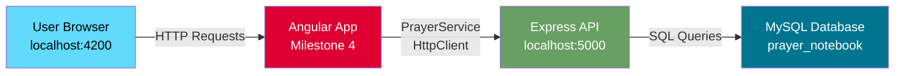
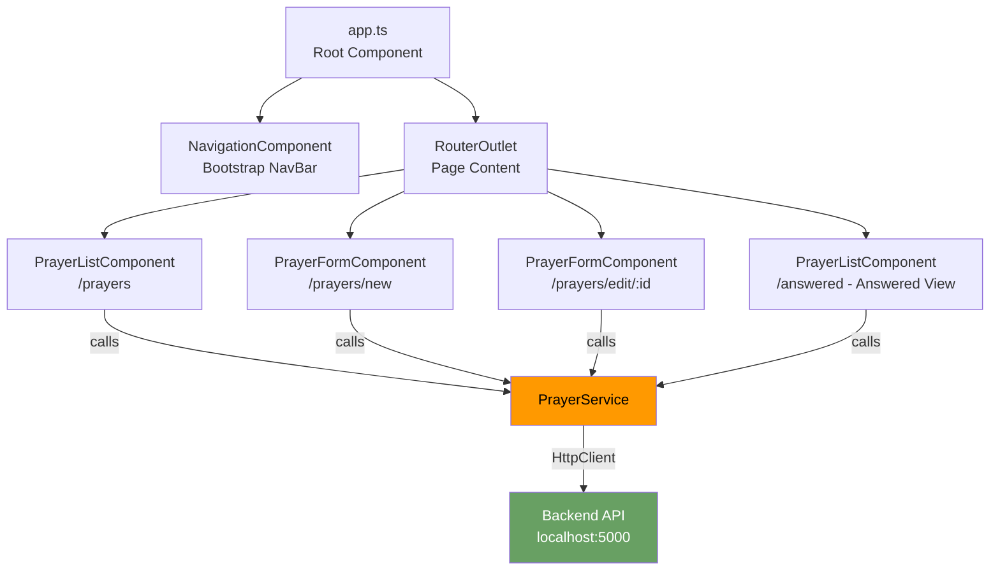

# CST-391: Milestone 4
## JavaScript Web Application Development — Angular Frontend

**Application Name:** Prayer Notebook  
**Author:** Seline Bowens  
**Date:** 2/22/2026  

---

## Table of Contents
1. [Introduction](#introduction)
2. [Video Demonstration](#video-demonstration)
3. [Powerpoint Presentation](#powerpoint-presentation)
4. [System Architecture](#system-architecture)
5. [Design Updates](#design-updates)
6. [Updates & Known Issues](#updates--known-issues)
7. [Component Structure](#component-structure)
8. [REST API Integration](#rest-api-integration)
9. [Conclusion](#conclusion)

---

## Introduction

Milestone 4 is about building the visual side of the Prayer Notebook app using Angular. While Milestone 3 built the backend that stores and manages prayer data, this milestone builds the screens that users actually see and interact with — things like buttons, forms, and tables.
Angular is a tool made by Google that helps developers build web pages using TypeScript. It organizes a webpage into separate pieces called components, where each component controls one part of the screen. In this milestone, I built four components: a navigation bar, a prayer list, a prayer form, and the routing that decides which page to show.
The Angular app connects to the Milestone 3 backend running on port 5000. When a user clicks a button, the app sends a request to the backend, which talks to the MySQL database and sends back the result. The goal of this milestone was to make sure users can Create, Read, Update, and Delete prayers directly from the browser — and all four operations are working correctly

---

## Video Demonstration

- https://www.loom.com/share/b9d8c47e8936497691381d58b5cc87d3

- *cont* https://www.loom.com/share/6b75e2cb68e0426ba8a2c43fbdfcb8c2

The screencast demonstrates full CRUD operations through the Angular frontend including navigation, creating a prayer, editing, marking as answered, and deleting.

---
## Powerpoint Presentation

**PowerPoint:** [View Presentation](./CST-391-Milestone4-presentation.pptx)

---

## System Architecture

The following diagram shows how the Angular frontend connects to the backend API and database:

---

## Component Architecture

---

## Design Updates

The Angular frontend was built to connect with the Milestone 3 REST API backend. 
The overall design follows the original wireframes from Milestone 1 as closely as 
possible given the time available. Below is a comparison of what was planned versus 
what was built.

### Pages Built

**All Prayers Page**
The wireframe planned prayer cards with a filter dropdown, sort dropdown, and 
pagination at the bottom. What was built instead is a Bootstrap table with rows 
showing title, description, category, status, date, and action buttons. The table 
layout was chosen because it is cleaner and easier to read when there are multiple 
prayers. Filter, sort, and pagination are noted as future enhancements.

**Add/Edit Prayer Form**
This page closely matches the original wireframe. It includes the prayer title input, 
category dropdown, description textarea, notes textarea, and Save/Cancel buttons. 
The same form is reused for both creating and editing a prayer, which matches the 
wireframe design exactly.

**Answered Prayers Page**
The wireframe planned a date filter (This Month, This Week, etc.) and a total count 
of answered prayers. What was built is the same table layout as the All Prayers page, 
filtered to show only answered prayers. The date filter was not implemented due to 
time constraints.

### Pages Not Built in Milestone 4

| Page | Reason |
|------|--------|
| Login Page | Authentication is planned for a future milestone. userId is hardcoded as 1 for now. |
| Dashboard/Home Page | The wireframe showed stats cards and recent prayers. This was not built due to time constraints. |
| Categories Management Page | Category CRUD through the UI was not implemented. Categories are hardcoded in the form dropdown. |
| Prayer Details View | Prayers are managed directly from the list table. A separate details page was not needed for basic CRUD. |
| Search Results Page | The backend search endpoint exists at GET /api/prayers/search but the frontend page was not built yet. |

### Why These Changes Were Made

The focus of Milestone 4 is to demonstrate full CRUD operations through a working 
Angular frontend connected to the backend API. All four operations — Create, Read, 
Update, and Delete — are fully working.

---

## Updates & Known Issues

| # | Item | Type | Status |
|---|------|------|--------|
| 1 | Angular frontend connected to Milestone 3 API on port 5000 | Update | Done |
| 2 | Full CRUD operations for prayers (Create, Read, Update, Delete) | Update | Done |
| 3 | Bootstrap NavBar with Home, All Prayers, Add Prayer, Answered Prayers | Update | Done |
| 4 | Mark prayer as answered — status changes to green badge | Update | Done |
| 5 | Answered Prayers page shows only answered prayers | Update | Done |
| 6 | React frontend replaced with Angular frontend in Milestone 4 | Design Change | Noted |
| 7 | Category names display as "Category 1/2/3" instead of actual names | Known Issue | TO DO |
| 8 | Categories in the form are hardcoded, not loaded from the API | Known Issue | TO DO |
| 9 | No user authentication — userId is hardcoded as 1 | Known Issue | TO DO |
| 10 | Search functionality not yet implemented | TO DO | Pending |
| 11 | Edit form was initially stuck in loading state due to Angular change detection | Bug Fixed | Fixed |

---

## Component Structure

### NavigationComponent
Displays the Bootstrap navbar at the top of every page. Contains links to Home, All Prayers, Add Prayer, and Answered Prayers.

### PrayerListComponent
Displays all prayers in a Bootstrap-styled table with columns for Title, Description, Category, Status, Date Created, and Actions. The same component is reused for the Answered Prayers page — it detects the current route and filters accordingly. Each row has Edit, Delete, and Mark Answered buttons.

### PrayerFormComponent
A single form component used for both creating and editing prayers. When accessed via `/prayers/new`, it shows a blank form for creating a new prayer. When accessed via `/prayers/edit/:id`, it loads the existing prayer data from the API and pre-fills the form for editing.

### PrayerService
A shared Angular service that handles all HTTP communication with the backend API. It contains methods for all CRUD operations and is injected into any component that needs to interact with prayer data.

---

## REST API Integration

The Angular app communicates with the Milestone 3 backend through the `PrayerService`. All endpoints use `userId=1` as a hardcoded parameter since authentication has not been implemented yet.

| Method | Endpoint | Used In |
|--------|----------|---------|
| GET | /api/prayers?userId=1 | PrayerListComponent |
| GET | /api/prayers/:id?userId=1 | PrayerFormComponent (edit mode) |
| GET | /api/prayers/answered?userId=1 | PrayerListComponent (answered view) |
| POST | /api/prayers | PrayerFormComponent (create mode) |
| PUT | /api/prayers/:id | PrayerFormComponent (edit mode) |
| PUT | /api/prayers/:id/answer | PrayerListComponent (mark answered) |
| DELETE | /api/prayers/:id?userId=1 | PrayerListComponent |

---

## Conclusion

Milestone 4 successfully delivers a working Angular frontend for the Prayer Notebook app. Users can now view their prayers in a table, add new ones through a form, edit existing ones, delete them, and mark them as answered. The app connects to the Milestone 3 backend and all CRUD operations work correctly.
Through this milestone, I learned how to build an Angular app from scratch, how to create components, use a service to make API calls, set up routing between pages, and bind form inputs to data using ngModel. I also learned how to debug a real issue where the edit form was stuck on a loading spinner because Angular was not detecting the data change after the API responded.
The remaining known issues such as hardcoded categories and no login system will be addressed in future milestones. Together, Milestones 3 and 4 form a complete full-stack application where the Angular frontend and the Node.js backend work together to give users a functional Prayer Notebook.

---