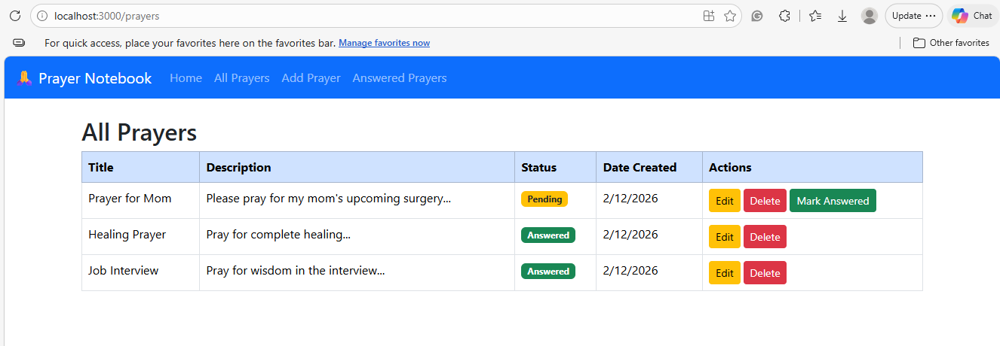
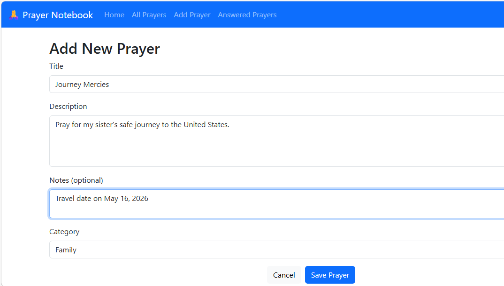
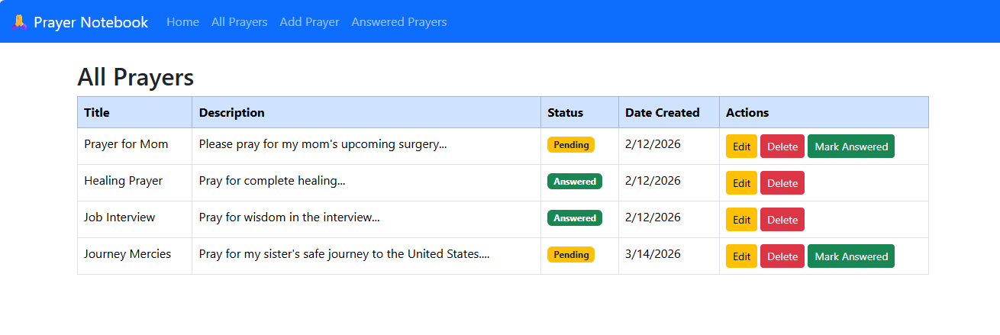
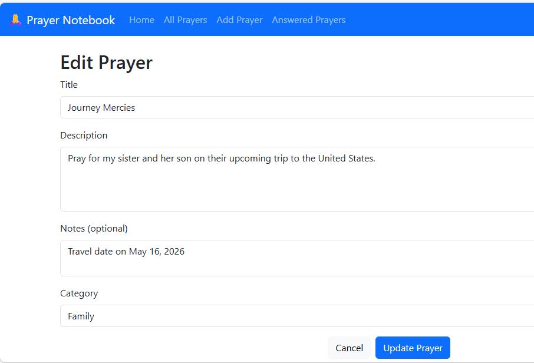
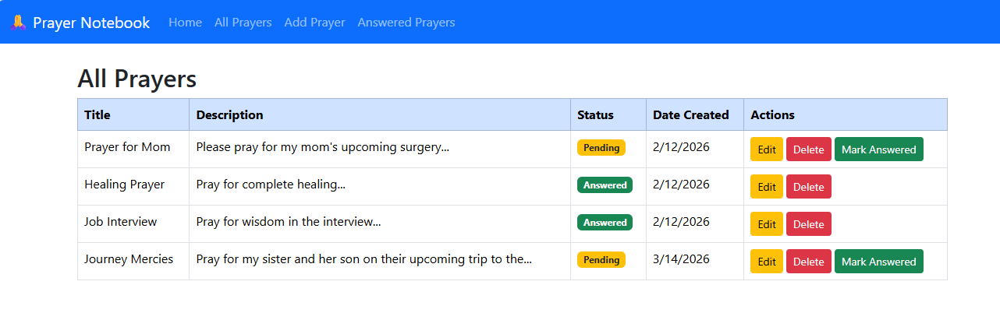
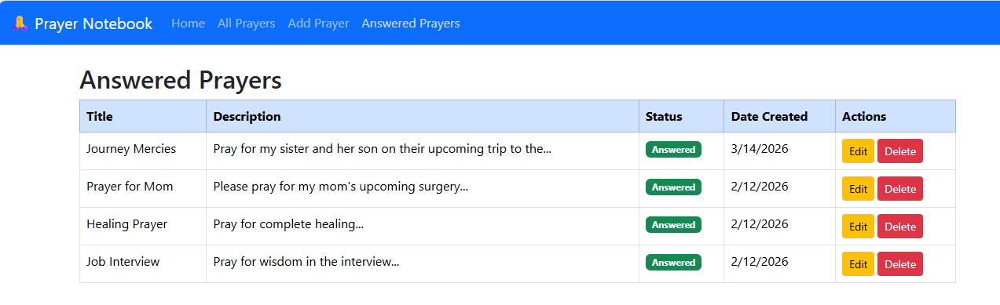
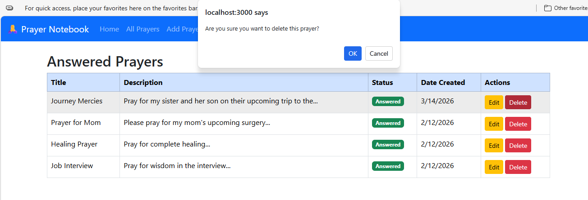
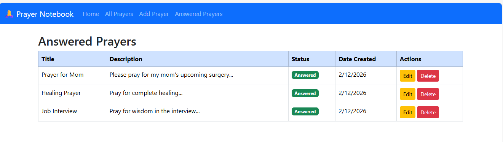

# CST-391: Milestone 5
## JavaScript Web Application Development - React Frontend for Prayer Notebook

**Student:** Seline Bowens

**Date:** 3/14/2026  

---

## Table of Contents
1. [Introduction](#introduction)
2. [Video Demonstration](#video-demonstration)
3. [What was Built](#what-was-built)
4. [Application Screenshots](#application-screenshots)
5. [Design Updates](#design-updates)
6. [REST API Documentation](#rest-api-documentation)
7. [Known Issues and TO DO Items](#known-issues-and-to-do-items)
8. [What I Learned](#what-i-learned)
9. [Installation and Setup](#installation-and-setup)
10. [Conclusion](#conclusion)

---

## Introduction

 In this milestone is about React frontend that connects to the backend API which was created in Milestone 3. The goal was to give the Prayer Notebook a real user interface, so that instead of using Postman to test API calls, a user can simply open a browser and manage their prayers by clicking buttons on a webpage.

The Prayer Notebook is a web app designed to help Christians keep track of their prayer life. Users can add prayer requests, see all their prayers in a list, update a prayer, mark a prayer as answered when God responds, and delete prayers they no longer need. The Answered Prayers page shows a separate list of all prayers that have been marked as answered.

---
## Video Demonstration

### Loom Screencast

- [Part 1](https://www.loom.com/share/0e5f4f0629694f228712c22583c848c8)
- [Part 2](https://www.loom.com/share/a249f9fd55d74851bfcdde703bcdd0ad)

---

### PowerPoint Presentation

**PowerPoint:** [View Presentation](./CST-391-Milestone5%20presentation.pptx)

---

## What was Built

The React app has four main pages connected by a Bootstrap navigation bar:

- **All Prayers** - shows every prayer in a table with Edit, Delete, and Mark Answered buttons
- **Add Prayer** - a form to create a new prayer request
- **Edit Prayer** - the same form, but pre-filled with an existing prayer's data for updating
- **Answered Prayers** - shows only prayers that have been marked as answered

The app connects to the Milestone 3 Express API running on port 5000. Every action the user takes such as loading prayers, saving a new prayer, updating a prayer, marking one as answered, or deleting one, sends an HTTP request to the API. These actions reads or writes to the MySQL database.

---

## Application Screenshots

### All Prayers Page



The main page of the app showing all prayer requests loaded from the API. Each row in the table shows the prayer title, a short description, whether it is Pending or Answered, the date it was created, and action buttons. Prayers that are still Pending show an orange badge and a green "Mark Answered" button. Prayers already Answered show a green badge with no Mark Answered button.

---

### Add New Prayer Form




The Add New Prayer form filled in with a new prayer called "Journey Mercies." The form has fields for Title, Description, Notes (optional), and Category. The Cancel button goes back to the prayer list without saving. The Save Prayer button sends the data to the API and saves it to the database.

---

### New Prayer Added to List



After clicking Save Prayer, the app navigates back to the All Prayers page and the new prayer "Journey Mercies" appears at the bottom of the table. This confirms the prayer was successfully saved to the MySQL database and the list was refreshed.

---

### Edit Prayer Form Pre-filled




The Edit Prayer form for "Journey Mercies" showing the existing data already loaded into the form fields. The page title shows "Edit Prayer" instead of "Add New Prayer." The description was updated to include more detail about the prayer. The Update Prayer button sends a PUT request to the API to save the changes.

---

### Prayer Updated in List



After clicking Update Prayer, the app navigates back to the list and the updated description for "Journey Mercies" is visible in the table. This confirms the PUT request worked correctly and the database was updated.

---

### Answered Prayers Page



The Answered Prayers page showing only prayers that have been marked as answered. All rows show a green "Answered" badge. This page uses the same PrayerList component as the All Prayers page, but passes answeredOnly={true} as a prop so it only fetches answered prayers from the API.

---

### Delete Confirmation Dialog



When the user clicks the Delete button on any prayer, a confirmation dialog appears asking "Are you sure you want to delete this prayer?" If the user clicks OK, the prayer is deleted from the database. If they click Cancel, nothing happens. This prevents accidental deletes.

---

### After Deleting a Prayer



After confirming the delete, the Answered Prayers page refreshes and the deleted prayer "Journey Mercies" is no longer in the list. Only three prayers remain, confirming the DELETE request to the API worked correctly.

---

## Design Updates

These are the changes made from the original Milestone 2 design:

| Change | Reason | Status |
|--------|--------|--------|
| Built React frontend (Milestone 5) in addition to Angular frontend (Milestone 4) | Course requires both Angular and React implementations | Completed |
| Combined Create and Edit into one `PrayerForm` component | Avoids repeating the same code twice. | Completed |
| Reused `PrayerList` for both All Prayers and Answered Prayers pages | One component handles both views using an `answeredOnly` prop | Completed |
| Fixed Mark Answered endpoint from `/answered` to `/answer` | Found mismatch between frontend code and actual API route during testing | Completed |
| Login page not built yet | Beyond the scope of Milestone 5, userId is hardcoded as 1 for now | TO DO |
| Category management page not built yet | Beyond the scope of Milestone 5 | TO DO |
| Prayer details view page not built yet | Beyond the scope of Milestone 5 | TO DO |
| Search bar not built yet | API supports search but the UI has not been connected yet | TO DO |

---

## REST API Documentation

The React app uses the Milestone 3 Express API. Base URL: `http://localhost:5000/api`

All endpoints use `userId=1` as a hardcoded query parameter because user authentication has not been built yet.

### Prayer Endpoints

| Method | Endpoint | What it does |
|--------|----------|--------------|
| GET | `/api/prayers?userId=1` | Load all prayers for user |
| GET | `/api/prayers/:id?userId=1` | Load one prayer by ID |
| GET | `/api/prayers/answered?userId=1` | Load answered prayers only |
| GET | `/api/prayers/search?userId=1&q=keyword` | Search prayers by keyword |
| GET | `/api/prayers/category/:id?userId=1` | Load prayers by category |
| POST | `/api/prayers?userId=1` | Create a new prayer |
| PUT | `/api/prayers/:id?userId=1` | Update an existing prayer |
| PUT | `/api/prayers/:id/answer?userId=1` | Mark a prayer as answered |
| DELETE | `/api/prayers/:id?userId=1` | Delete a prayer |

### Category Endpoints

| Method | Endpoint | What it does |
|--------|----------|--------------|
| GET | `/api/categories?userId=1` | Load all categories for user |
| GET | `/api/categories/:id?userId=1` | Load one category by ID |
| POST | `/api/categories?userId=1` | Create a new category |
| PUT | `/api/categories/:id?userId=1` | Update a category |
| DELETE | `/api/categories/:id?userId=1` | Delete a category |

---

## Known Issues and TO DO Items

| Issue | Priority | Notes |
|-------|----------|-------|
| No user login — userId hardcoded as 1 | High | Any user visiting the app sees user 1's prayers. Need to add login and JWT tokens |
| No category management page | Medium | Users cannot create or edit categories from the UI |
| No prayer details page | Medium | Clicking a prayer title does not open a details view yet |
| No search bar in the UI | Medium | The API has a search endpoint but the React app does not use it yet |
| No input validation messages | Low | The form uses HTML `required` but does not show custom error messages |
| All prayers load at once | Low | No pagination — could be slow if there are hundreds of prayers |

---

## What I Learned

**Reusing one component for two purposes.** In this milestone I learned how to make one component do two different things depending on what props it receives. The `PrayerForm` component checks whether an `id` was passed in the URL; if yes it is in edit mode and loads the existing prayer, if no it is in create mode with an empty form. The same idea applied to `PrayerList`; the `answeredOnly` prop tells it whether to load all prayers or only answered ones. This is a cleaner way to write code because I did not have to build two separate components for the same form.

**Connecting React to a real backend API.** I learned how to use Axios to send HTTP requests from a React component to an Express API. Every button in the UI: Save, Update, Delete, and Mark Answered, triggers an Axios call that talks to the backend. The `dataSource.js` file holds the base URL so I only have to write it once.

**Debugging API endpoint mismatches.** During testing, the Mark Answered button showed an error saying "Failed to mark prayer as answered." By checking the backend routes file, I found that the actual endpoint was `/prayers/:id/answer` but my code was calling `/prayers/:id/answered`. This taught me that when something fails, I should check both the frontend code and the backend routes to find where they do not match.

**Using React Router for navigation.** I used `BrowserRouter`, `Routes`, `Route`, `Link`, and `useNavigate` to set up navigation between pages. The `useParams` hook in `PrayerForm` reads the prayer ID from the URL when the user clicks Edit, so the component knows which prayer to load from the API.

**useEffect for loading data.** The `useEffect` hook in `PrayerList` runs automatically when the component loads, calling the API to get the list of prayers. I also passed `answeredOnly` as a dependency so that when the prop changes — for example when switching between All Prayers and Answered Prayers — `useEffect` runs again and loads the correct data.

---

## Installation and Setup

### Step 1 — Start the Backend API (Milestone 3)
```bash
cd C:\git\cst391\milestones\milestone3\prayer-notebook-api
npm run dev
```
The API runs at `http://localhost:5000`

### Step 2 — Start the React Frontend (Milestone 5)
```bash
cd C:\git\cst391\milestones\milestone5\prayer-notebook-react
npm start
```
The app opens at `http://localhost:3000`

---

## Conclusion

The Prayer Notebook now has a working React frontend that lets users manage their prayers through a simple web interface. All five CRUD operations work correctly. Users can create, read, update, delete, and mark prayers as answered. The app uses a Bootstrap NavBar for easy navigation between pages, and all data is saved to a MySQL database through the Milestone 3 REST API. Several features from the original wireframes: login, categories management, search, and prayer details are still planned but not yet built. These are noted as TO DO items and may be added in Milestone 6.
