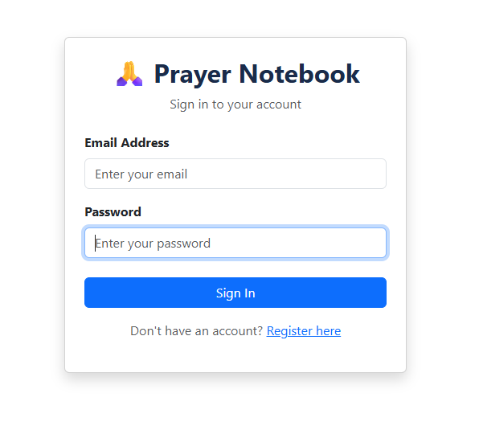
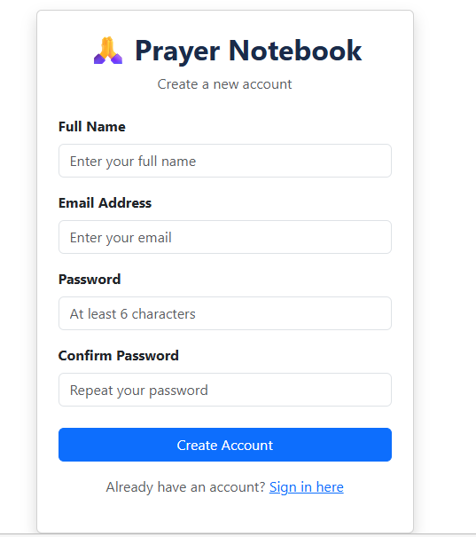
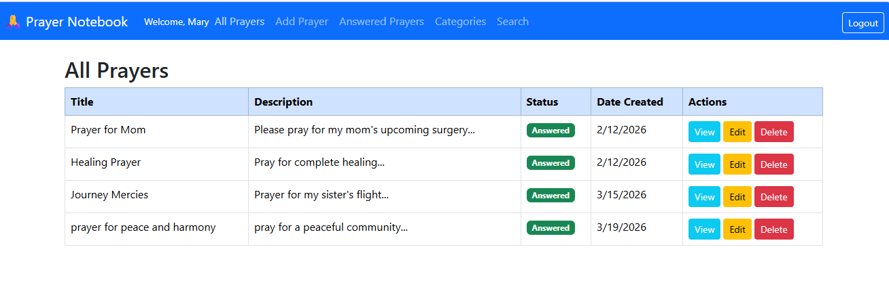
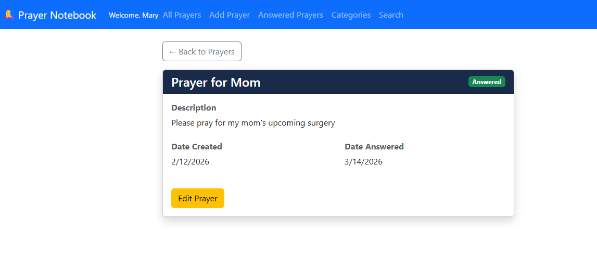
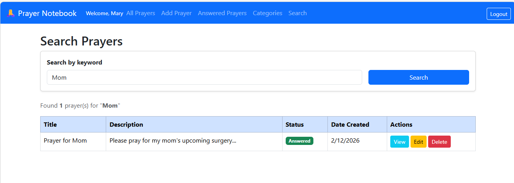
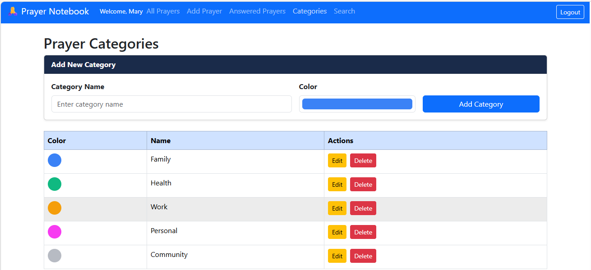

# CST-391: Milestone 6
## Benchmark - Full Project Presentation: Prayer Notebook

**Student:** Seline Bowens 

**Date:** 3/19/2026  
 
---

## Table of Contents
1. [Introduction](#introduction)
2. [Links](#links)
3. [What Was Built Across All Milestones](#what-was-built-across-all-milestones)
4. [Milestone 6 New Features](#milestone-6-new-features)
5. [Application Screenshots](#application-screenshots)
6. [Website Accessibility - Christian Worldview](#website-accessibility---christian-worldview)
7. [What I Learned](#what-i-learned)
8. [Installation and Setup](#installation-and-setup)
9. [Conclusion](#conclusion)

---

## Introduction

In this milestone, I completed the React frontend by adding the remaining pages from the original wireframes: login, registration, prayer details, category management, and search. I also combined all milestone PowerPoint presentations into one full project presentation and recorded a screencast demonstrating both the Angular and React applications working end-to-end.

The Prayer Notebook is a full stack web application that helps Christians organize and track their prayer life. It was built across four milestones: a Node.js/Express REST API backend in Milestone 3, an Angular frontend in Milestone 4, and a React frontend in Milestones 5 and 6.

---

## Links

### Loom Screencast

- [Part 1](https://www.loom.com/share/81b0bda27cfc46ffb7d6ed5be8411cf4)
- [Part 2](https://www.loom.com/share/48e21f16b75a4c9c998142516b95fb8f)
- [Part 3](https://www.loom.com/share/264e15c8197847cf9626e5c32417c593)
- [Part 4](https://www.loom.com/share/abe0183061b64809a3329c37c9744422)
- [Part 5](https://www.loom.com/share/94f7e88909a24c2088b94f01830f3dd6)
- [Part 6](https://www.loom.com/share/71291ceef00b47cd913154a0ec4f1d2b)

---

## Powerpoint Presentation

**PowerPoint:** [View Presentation](./CST-391-Milestone6-Presentation.pptx)

---
## What Was Built Across All Milestones

| Milestone | Focus | What Was Delivered |
|-----------|-------|-------------------|
| Milestone 3 | REST API | Node.js, Express, TypeScript, MySQL - 14 endpoints for prayers and categories |
| Milestone 4 | Angular Frontend | Angular 19 frontend with full CRUD connected to the Milestone 3 API |
| Milestone 5 | React Frontend | React 18 frontend with full CRUD - All Prayers, Add Prayer, Edit Prayer, Answered Prayers |
| Milestone 6 | Completed React App | Login, Register, Prayer Details, Categories Management, Search, Protected Routes |

---

## Milestone 6 New Features

In Milestone 6, the following pages were added to the React app:

**Login Page** - Users sign in with their email and password. Credentials are checked against the MySQL users table through the API. If the email or password is wrong, an error message is shown. A link to the Register page is shown for new users.

**Register Page** - New users create an account by entering their full name, email, and password. The form validates that both passwords match and that the password is at least 6 characters long. The account is saved to the database and the user is redirected to the login page.

**Prayer Details Page** - Clicking the View button on any prayer opens a full details page. It shows the prayer title, status badge, full description, notes, date created, and date answered if the prayer has been marked as answered. An Edit Prayer button opens the edit form.

**Categories Management Page** - Users can view all their prayer categories in a table. Each category shows a colored circle and the category name. Users can add a new category using the form at the top, edit any category inline by clicking the Edit button, and delete categories with a confirmation prompt.

**Search Page** - Users can type a keyword into the search bar and click Search. The app calls the API search endpoint and shows all matching prayers in a table. The result count is shown above the table. Each result has View, Edit, and Delete buttons.

**Protected Routes** - All pages are now protected. If a user tries to visit any page without being logged in, they are automatically redirected to the login page. The navbar also shows the logged-in user's name and a Logout button.

**Registration and Login API Endpoints** - Two new endpoints were added to the Milestone 3 backend:
- `POST /api/auth/register` - creates a new user account
- `POST /api/auth/login` - checks credentials and returns user info

---

## Application Screenshots

### Login Page



The login page with email and password fields. A link to the Register page is shown at the bottom for new users.

---

### Register Page



The registration form with fields for full name, email, password, and confirm password. The form validates that passwords match before submitting.

---

### All Prayers Page



The All Prayers page showing the full prayers table after logging in. The navbar shows "Welcome, Mary" confirming the logged-in user.

---

### Prayer Details Page



The Prayer Details page for "Prayer for Mom" showing the full description, date created, date answered, and status badge. 

---

### Search Page



The Search page showing results for the keyword "Mom". One prayer was found and displayed in the table.

---

### Categories Page



The Prayer Categories page showing five categories: Family, Health, Work, Personal, and Community, each with a colored circle.

---

## Website Accessibility - Christian Worldview

As Christians, we believe every person is made in the image of God, and that includes people with disabilities. When we build web applications, we have a responsibility to make sure everyone can use them, regardless of whether they are blind, deaf, have motor disabilities, or cognitive challenges. The Prayer Notebook is a spiritual tool. That makes accessibility even more important. A person who is visually impaired should be just as able to record and track their prayers as someone without any disability. Keeping them out of a prayer app because it was not built accessibly goes against the spirit of loving our neighbor.

In practice, building with accessibility in mind means following these best practices:

- Using alt text on all images so screen readers can describe them to people who cannot see them. 
- Using high color contrast between text and background so people with low vision can read the content. 
- Making sure all buttons and links can be used with a keyboard and not just a mouse, so people with motor disabilities can navigate the app. 
- Using clear and simple language so the content is easy to understand. 
- Adding labels to all form inputs so screen readers can identify what each field is for. 
- Following the WCAG 2.1 guidelines, which is the international standard for web accessibility.

---

## What I Learned

1. **Adding new API endpoints is straightforward when the structure is already set up:** When I needed the register and login endpoints, I followed the same pattern already used for prayers and categories - queries, DAO, controller, routes. The consistent structure made it easy to add new features without breaking anything.

2. **Protected routes are simple to implement in React:** By storing `isLoggedIn` in state in `App.js` and wrapping each route with a condition, every page automatically redirects to login if the user is not authenticated.

3. **Inline editing gives a better user experience:** The Categories page uses inline editing. when the user clicks Edit, the table row transforms into input fields right there on the page. This feels more natural than navigating to a separate edit page for small changes like a category name or color.

4. **The same Axios pattern works for every new page:** Every new page I built in Milestone 6 used the same `useEffect` and Axios pattern from the earlier pages. Once I understood the pattern well, adding a new page with API calls only took a few minutes.

The Prayer Notebook now has a real login system, real data stored in a database, and real navigation between multiple pages. This project gave me confidence that I can build real web applications using the skills from this course.

---

## Installation and Setup

### Step 1. Start the Backend API (Milestone 3)
```bash
cd C:\git\cst391\milestones\milestone3\prayer-notebook-api
npm run dev
```
API runs at `http://localhost:5000`

### Step 2.  Start the React Frontend (Milestone 6)
```bash
cd C:\git\cst391\milestones\milestone6\prayer-notebook-react
npm start
```
App opens at `http://localhost:3000`

---

## Conclusion

Milestone 6 completes the Prayer Notebook project. The React frontend now has all the pages from the original wireframes: login, registration, prayer listing, prayer details, category management, search, and answered prayers. All pages are protected by a login check so only authenticated users can access them.

Across all six milestones, this project covered the full stack of web development. Milestone 3 built the database and API. Milestone 4 built an Angular frontend. Milestones 5 and 6 built a React frontend. The same backend API powers both frontends, which shows how a well-designed API can serve multiple clients.

The skills I used in this project; building REST APIs, connecting frontends to backends, managing state in React, navigating between pages with React Router, and thinking about user experience, are directly applicable to real-world web development work.
